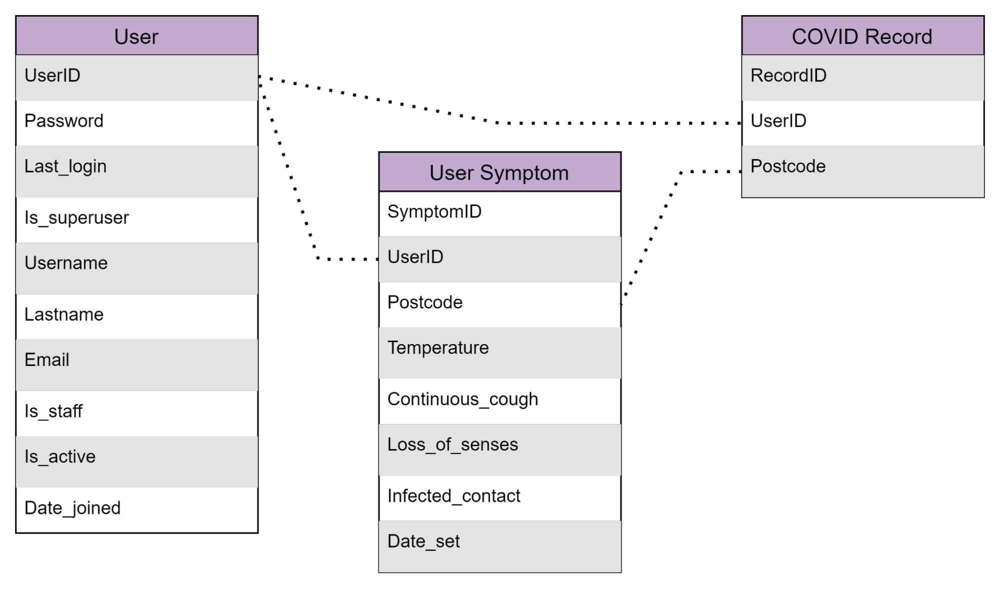

# Visual Spread of Disease NEA - Samuel Margerison 21/05/2021


## {1} Analysis 


### {1.1}   Introduction & Problem Background   

In recent years, worldwide pandemics have had lasting effects on the way we look at disease, making people fear for their lives and their loved ones. For example, many people became in tune with hygiene and disease prevention due to the worldwide spread of Coronavirus that has permanently changed the way we live and view disease as a whole. This fear epidemic has been magnified by the increasing number of fake and unreliable news sources using flashy figures and exaggerated headlines in order to hook users, amplifying public fears.

This project will be based around tracking and monitoring the spread of disease as accurately as possible and visualising the spread so that anyone can understand. The user should be able to access a wide range of information about COVID disease world-wide and locally. Data will be retrieved via a web scraping algorithm which will then be sent into a database in order to be visualised using graphs and world maps. This software aims to be as realistic as possible and doesn’t have the intent of exploiting its users by using hyperbolic data and misleading language.

My project also aims to inform the user on whether they may have been in contact with someone who, or have themselves, are likely to have been infected by allowing users to keep updated with current symptoms and other users current symptoms. 

The main target audience for this project is a wide range of people that want to be informed on the subject but are not data experts. My specific client currently works for the NHS as a graphic designer and believes  that the understanding of data in a visual form is just as important as the data itself.


### {1.2}   Research		

For this project I aim to research in a variety of different ways in order to make the model up to my clients standards. Firstly, I will conduct a survey to see what my friends and family found intuitive and what they found impractical about existing data visualisers. I will also conduct my own research on popular disease trackers, identifying what worked and what could be improved. I will then test said programs against mine to see where improvements could be made.

Furthermore, I will research well made computer algorithms that perform web scraping, allowing my program to gather data for various websites across the globe and store said data within a database. Research on how to properly implement this database on graphs and visual aids may also need to occur.


### {1.3.1}	Client Overview

My client for this project is my dad, Paul Margerison, who is currently working as a graphic designer for the NHS, and has been working as a graphical designer all of his life. He believes that good and bad data representation can have a major impact on a user's perception of the news as a whole.

For this project, I have prepared a variety of questions related to the exact purpose and look of the program. Since the program is for a specific client, it is extremely important for the developer to maintain contact with the client throughout the production process so they are satisfied with the result.


### {1.3.2}   Interview


1. **What kind of information would you like to find within my program?** Statistical and numerical data would be more interesting and important as descriptive data is already easily accessible.
2. **Would you like there to be a login system?** Yes I would like a login system however if my username and passwords are insecure I would prefer not.
3. **Should the program focus on a specific country?** I would prefer if the program gave an overview of the world as a whole, while still making the data easily readable.

    **(d) What data about the disease would you like to have on this program?** As mentioned before, an overview of all the key statistics such as death-count, total number of cases, and potentially how these rates change over time.


**(e) Would you like to see a map of your local area?** A local map of London may be useful, especially if it is done in real time.

**(f) Are there any more features you would like to see?** If you were able to add your symptoms, contributing to a map of London, it would be interesting to see what counties are infected.


### {1.3.3}   Questionnaire

I asked my dad to conduct a quick survey with a few of his co-workers, who are also graphic designers working on the NHS website and its usability, in order to flesh out the design of the data visualiser. The results of the 17 surveys are as follows:


<p id="gdcalert1" ><span style="color: red; font-weight: bold">>>>>>  gd2md-html alert: inline image link here (to images/image1.png). Store image on your image server and adjust path/filename/extension if necessary. </span><br>(<a href="#">Back to top</a>)(<a href="#gdcalert2">Next alert</a>)<br><span style="color: red; font-weight: bold">>>>>> </span></p>





Though I previously asked Paul how I should represent the figures, I still believe that another opinion is needed, but the survey yielded the same results: nobody picked a table and the majority picked a world map.


<p id="gdcalert2" ><span style="color: red; font-weight: bold">>>>>>  gd2md-html alert: inline image link here (to images/image2.png). Store image on your image server and adjust path/filename/extension if necessary. </span><br>(<a href="#">Back to top</a>)(<a href="#gdcalert3">Next alert</a>)<br><span style="color: red; font-weight: bold">>>>>> </span></p>


This result was also expected, however for the sake of my client I will incorporate both suggestions into the project. Using a drop down menu, I will be able to have the program display a lot of data but separate it so each infographic is readable.


<p id="gdcalert3" ><span style="color: red; font-weight: bold">>>>>>  gd2md-html alert: inline image link here (to images/image3.png). Store image on your image server and adjust path/filename/extension if necessary. </span><br>(<a href="#">Back to top</a>)(<a href="#gdcalert4">Next alert</a>)<br><span style="color: red; font-weight: bold">>>>>> </span></p>


A login system is the easiest way to keep data secure, while still giving incumbent or new users access to the application. This also allows the program to keep track of the current user's infection status, as well as letting other users know who is infected also.


<p id="gdcalert4" ><span style="color: red; font-weight: bold">>>>>>  gd2md-html alert: inline image link here (to images/image4.png). Store image on your image server and adjust path/filename/extension if necessary. </span><br>(<a href="#">Back to top</a>)(<a href="#gdcalert5">Next alert</a>)<br><span style="color: red; font-weight: bold">>>>>> </span></p>


Though only a small majority of users have requested a symptoms checker, I believe it is important for users to be able to keep track of when they were likely to have been infected, as well as who they have come into contact with. 


<p id="gdcalert5" ><span style="color: red; font-weight: bold">>>>>>  gd2md-html alert: inline image link here (to images/image5.png). Store image on your image server and adjust path/filename/extension if necessary. </span><br>(<a href="#">Back to top</a>)(<a href="#gdcalert6">Next alert</a>)<br><span style="color: red; font-weight: bold">>>>>> </span></p>


For this local map I will use information from the COVID symptoms checker:

each user can input the postcode they are currently in, and depending on whether they are likely to have covid, it is then added to a map of london, producing a secondary local map


### **{1.3.4}  Interview and Questionnaire Summary **

**Front End - **Both my client and survey results are clear that the design of the web page itself should be simplistic and should lack unneeded and unwanted information. Furthermore, I have understood that the displayed information should be separated into different pages altogether, and should only be seen one at a time, hence the explicit request of a drop down menu.

**Back End **-For the backends overall design structure I will be making use of a python web framework, allowing the project to be accessed on a local server. Furthermore,  As well as this, I will use web scraping algorithms in order to retrieve data off the web, SQL Database migration automation, and java to produce a graphic data map. 


## **{1.4}   Objectives**


1. **Login System**
    1. When a user enters the correct details they will be sent to the main menu.
    2. Simple registration page allowing new users to register.
    3. Each user should have a unique ID with an appropriately sized password.
    4. If a user enters incorrect information, the system will provide an error message.
    5. Passwords stored in a database secured by a hashing algorithm
    6. When a user enters the correct details the program should assign the username to any information they update the site with.
    7. User should be able to logout at any time using the logout button.
2. **Overall Website**
    8. Website should be organised into multiple pages, each with different uses.
    9. Each page should have a functioning header.
    10. Each page should include a sidebar directing users to different pages within the website.
3. **Menu Page**
    11. Page will connect to the symptoms database.
    12. Page should display all user symptoms updates from newest to oldest.
    13. Each post should contain the author, the date posted and symptom details such as current temperature and contact with the infected.
4. **Update Symptoms Page**
    14. Users should be prompted with a short questionnaire, providing the database with information such as loss of senses, current temperature and other covid-related symptoms.
    15. When user presses the submit button, the application will return the user to the main menu
    16. When the user submits symptoms, new post should be displayed on the main menu with the current date automatically set.
    17. When the user submits symptoms, the database should be updated with this new information
5. **Web Scraping Algorithm**
    18. When the user enters the COVID Data map page, the web scraping algorithm should begin
    19. Algorithm should strip the webpage of irrelevant information, leaving only data such as country,total cases, total deaths, active cases and total recovered.
    20. Information should be placed in a csv file in the correct order.
    21. SQL query should automatically migrate CSV file into database, updating any previous records
6. **World Data Map**
    22. Database should match JSON file countries so data fits corresponding countries
    23. JSON containing vector data for world map should produce a simple world map outline.
    24. Data within DB should be statistically coded to follow a colour spectrum on the sidebar
    25. Each country should be filled with its corresponding choropleth colour
    26. When countries are hovered over, the countries corresponding data should be displayed
    27. Seperate page with table showing the raw data for each country should be linked
7. **Local Data Map**
    28. An algorithm should sort through all user symptom cases and identify which ones are likely to be covid related.
    29. A record of all cases of user covid cases should be added to a database table.
    30. New dictionary should be created using the list of user input cases and their matching postcodes.
    31. Algorithms should match user case postcodes to postcodes on a JSON vector map. 
    32. Choropleth vector map should be created, with colours corresponding to the number of cases
    33. Colour key that should updates colours corresponding to the highest number of cases

	

**		**


### {1.4.2}    System Limitations


    As I am under time pressure and am constrained by my programming skill level, various features may be left out in order to perfect the main program objectives.


    If the user is offline, they will be unable to refresh the database and will be viewing outdated data, which is the data the user last saw when online or the original data if the user has never used the program.


## {1.5} 			Existing Systems


### {1.5.1}			CDC COVID Data Tracker

[https://covid.cdc.gov/covid-data-tracker/#county-view](https://covid.cdc.gov/covid-data-tracker/#county-view) 

The data visualiser used by CDC  uses a drop down menu allowing the user to pick and choose what data is being displayed.  For instance in this capture, deaths are mapped and visualised by the darkness of the shading, and the colours corresponding to the data are clearly displayed. 

This way of displaying data is simple to understand as there is no need to read text about the data, only figures corresponding to the colour.

CDC’s data visualisation has a number of problems that could be improved, for instance, this data can’t be accessed offline as it is on a website connected to the internet. As well as this, the diagram only shows the United States data, and though this website is centred around tracking COVID-19 across the United States, it is still an aspect that could be improved.


### {1.5.2}		Infectious Diseases Hub

[https://www.id-hub.com/disease-tracker/?disease=Zika](https://www.id-hub.com/disease-tracker/?disease=Zika) 

Infectious diseases hub collects data from various health institutes around the world and displays the location of where the data was found using a pinpoint on a world map. There is a drop down menu allowing you to view a plethora of different diseases, as well as a small description of each one. Each pinpoint, when clicked, gives a brief statement from the health institute about the current

There are many immediate issues seen with this disease tracker that have simple solutions that I will implement into my tracker. Firstly, the Legend widget does not correspond to the map as there are no green, red or orange areas shaded on the map, rendering the widget useless. Secondly, this map was swiped from google maps and the website needs internet access to open. Finally, above the zoom in/out widget, there is a white square that has no use, making the website seem less professional and less pleasing in a graphical design sense.


## {1.6} 		Solutions 


### {1.6.1}		Frameworks

For this project I will be using a variety of different coding languages in order to meet my clients requirements. Before starting this project, I had already predetermined what languages I wanted to use based on my prior skill level and aspects I knew would be implemented into a data visualisation project such as this.


<table>
  <tr>
   <td> LANGUAGE
   </td>
   <td>
   </td>
  </tr>
  <tr>
   <td> Python
   </td>
   <td>Python is a simple and extremely flexible programming language that allows me to use a variety of tools such as django, flask and other tools to create server oriented programs. It must also be mentioned that I am most comfortable writing in python, so it is a clear choice using python as my main language for this project
   </td>
  </tr>
  <tr>
   <td> SQL
   </td>
   <td>SQL is a necessity for any project that is uses a database, which is why I will definitely uses this frequently as my program requires constant database updates.
   </td>
  </tr>
  <tr>
   <td>HTML
   </td>
   <td>In order to produce functioning and visually appealing web pages I must use HTML to produce a working front-end
   </td>
  </tr>
</table>


<table>
  <tr>
   <td>Python Frameworks
   </td>
   <td>
   </td>
  </tr>
  <tr>
   <td>GUI Packages
<p>
Framework
   </td>
   <td>GUI Packages are a widget oriented framework that allows the developer to produce an individual app. One main advantage of this is that when the user does not need access to a web page launcher which web frameworks do. Many packages such as TKinter have many tools within them that make producing infographics and interfaces simple and effective.
   </td>
  </tr>
  <tr>
   <td>Web Frameworks
   </td>
   <td>Web frameworks do require access to a web page launcher however they do not require internet to run, all that is required is access to the computers ports, which is standard for any PC. As well as this  web frameworks often have pre built frameworks within them so the developer does not have to waste time starting from scratch. Furthermore, using different language algorithms within the project is much easier within these frameworks. 
   </td>
  </tr>
</table>


I believe that using a web framework is ideal as I will be using a range of languages, not to mention that my client and I both have access to a web page launcher so the frameworks disadvantages are not a problem.


<table>
  <tr>
   <td>Python Web Frameworks
   </td>
   <td>
   </td>
  </tr>
  <tr>
   <td>Django
   </td>
   <td>Django is a free open-source full-stack python framework meaning it contains most of the necessary features by default when a new project is created. Django is especially useful as it uses ORM (Object Relational Mapping) to map objects to database tables, using a variety of databases such as postgreSQL and SQLite. This is particularly useful for my project as I will primarily be using SQLite.
   </td>
  </tr>
  <tr>
   <td>Flask
   </td>
   <td>A python web framework that builds a solid web application foundation. Unlike Django, Flask is relatively lightweight and simple, making it much easier to pick up, not to mention that I have had some prior knowledge within Flask. 
   </td>
  </tr>
</table>


Though Flask may be simpler and take less time to fully understand, Django’s database accessibility features are too useful to pass on and attempting to connect a database to Flask is an illogical waste of time, which is why I will be using Django for this project. 


<table>
  <tr>
   <td>Geospatial Data Visualisation Library
   </td>
   <td>
   </td>
  </tr>
  <tr>
   <td>Folium
   </td>
   <td>Folium is a library built on Leaflet.js that enables users to create maps within python, rather than using java. Folium has the ability to create multi-layered complex maps, which I am unlikely to make use of as well as making folium potentially harder to learn and understand compared to other libraries.
   </td>
  </tr>
  <tr>
   <td>Plotly / Plotly Express
   </td>
   <td>Plotly is a simple and intuitive data visualisation library with a high level application programming interface. Plotly also makes use of Dash, which may become useful as it gives the user the ability to deploy web apps.
   </td>
  </tr>
</table>


As data visualisation in python is a new concept to me and the map that I intend to create is fairly simple, I want an easy to learn library, which is why I will use Plotly for this project. As well as this, plotly has a lot of information on its website on how to create clean choropleth maps, which is what I will use to help me create my own.


### {1.6.2}		Finding Data Online 


    In order to visualise data, I need to collect the data using web scraping: Web scraping is a method of using various internet browsers to extract information.


<p id="gdcalert6" ><span style="color: red; font-weight: bold">>>>>>  gd2md-html alert: inline drawings not supported directly from Docs. You may want to copy the inline drawing to a standalone drawing and export by reference. See <a href="https://github.com/evbacher/gd2md-html/wiki/Google-Drawings-by-reference">Google Drawings by reference</a> for details. The img URL below is a placeholder. </span><br>(<a href="#">Back to top</a>)(<a href="#gdcalert7">Next alert</a>)<br><span style="color: red; font-weight: bold">>>>>> </span></p>


    A chosen scraping tool sends a request to a proxy server that creates a link to a target website. This target website either accepts or rejects the request given by the scraping tool and returns a response to the proxy server, which then relays the response back to the user.


### {1.6.3}	Existing Web Scraping Systems


    **ScrapingBee:**


    ScrapingBee is a complex web scraping API that has multiple uses including bulk web scraping, allowing the user to retrieve data from thousands if not millions of websites at once, making retrieving accurate information much easier. As well as this, ScrapingBee is able to identify keywords and check backlinks all at once. Finally the system is also used for the passive information gathering section of a  penetration test, in order to find social media pages, client details and more valuable information.


    ScrapingBee is a very complex system that has too many  functions that are not relevant for processes that I will be carrying out. For my project, I will only need a simple web scraping algorithm for very specific websites, meaning bulk scraping is not needed and neither is scraping bees other functions.  Furthermore, Scraping Bee is not free, meaning that if a user was to use my program, there would be a monthly fee that either I would have to pay or I would have to pay, which is not logical to pay if I am able to make an algorithm whose use is tailored specifically for my project.

**ParseHub:**


    Parse hub is a free, relatively simple and flexible web scraping program. Since it is a free package, it does not have as many features and scraping power as ScrapingBee does but similarly to ScrapingBee it does not require any coding knowledge. To reiterate, using Parse Hub contains the main problems that using any commercial web scraping program would. This program is not easily implemented into my code and it does not seem possible to automate the scraping process using a third party program.

**Conclusion:**


    These systems are however a good benchmark for how a web scraping algorithm should be produced: simply. Web scraping is about data abstraction and information hiding and my project should aim to break data down into the very least need to be understood and represented.


### {1.6.4}	Web Scraping Solutions

In order to properly web-scrape I will be using various modules including BeautifulSoup and Requests. The requests module is the scraping tool (as shown in the diagram) I will be using that allows me to send a request to a specific website and beautiful soup is able to identify patterns and words in the chosen website, and extract only key information needed.

The algorithm that extracts code will have to identify the key data specified, order  data into suitable rows and transfer them into a database.


<p id="gdcalert7" ><span style="color: red; font-weight: bold">>>>>>  gd2md-html alert: inline image link here (to images/image6.png). Store image on your image server and adjust path/filename/extension if necessary. </span><br>(<a href="#">Back to top</a>)(<a href="#gdcalert8">Next alert</a>)<br><span style="color: red; font-weight: bold">>>>>> </span></p>


This image shows the source code for the html of a coronavirus live update chart, where beautiful soup will scan across the page in order to identify the id name of the table, _‘main_table_countries_today’_.


### {1.6.5}   Software Architecture


    For this project the software I will be using is Django, which uses a Model, View, Controller architecture. This is the most common architecture among developers as it is able to separate a program of any size into 3 different parts:


    

<p id="gdcalert8" ><span style="color: red; font-weight: bold">>>>>>  gd2md-html alert: inline image link here (to images/image7.png). Store image on your image server and adjust path/filename/extension if necessary. </span><br>(<a href="#">Back to top</a>)(<a href="#gdcalert9">Next alert</a>)<br><span style="color: red; font-weight: bold">>>>>> </span></p>


    In this architecture the user will send a request to the controller, which acts as a link between user and server. The controller processes the request and calls the model, which contains all the data objects and acts as the backend to the whole application. Data is retrieved from the model and  the controller sends this to the view. The view is what the user can currently see, and a response is given on the page. This architecture allows for the model to be modified at any time as it is not coupled with the controller or view, it is only called for.


    MVC is beneficial to use for my program for numerous reasons:


* Ease of modification
* Ability to produce multiple views
* Each section is interdependent, allowing for frequent changes within the model without disrupting the entire architecture
* Allows for java to be integrated to produce a feature rich web application.


# {2}	  			 Design


## {2.1}		System Design Plan

	

The overall system will be fairly simple at first glance as the complexities of the program occur within the implementation of each node within the system.

In order to make the user system simpler, I will implement a guest system to make program testing easier, however depending on my clients preferences, the final design will not have a guest setting.


### {2.1.2}   Django App Framework

Django comes with a standard framework structure that makes it very simple to handle HTTP requests all within python. This prevents me from wasting time on building a web framework so I can spend more time on my core objectives.


<p id="gdcalert9" ><span style="color: red; font-weight: bold">>>>>>  gd2md-html alert: inline image link here (to images/image8.png). Store image on your image server and adjust path/filename/extension if necessary. </span><br>(<a href="#">Back to top</a>)(<a href="#gdcalert10">Next alert</a>)<br><span style="color: red; font-weight: bold">>>>>> </span></p>


The Django Framework uses python objects known as models to represent the data being used in the program. Data includes SQL tables within a database, which also allows SQL data to be easily interpreted and modified within python.

Each function within views receives HTTP requests and returns the appropriate response corresponding to its URL pattern in urls.py. The relationship between models and views allows views to access the data to satisfy requests.

As well returning the appropriate response to its URL pattern, each  view will also call its corresponding template if it has one it is associated with, such that the template is displayed when the HTTP response is made.


### {2.1.3}  Django App Hierarchy

My Django Project will be made up of two apps, each with their own set of models, views and url patterns, making it much in the long run to repair and maintain the project if something goes wrong. The project will be split into a front app and a user app, such that user related algorithms are contained separately, allowing me to fix problems with each individual app without affecting the whole system.


<p id="gdcalert10" ><span style="color: red; font-weight: bold">>>>>>  gd2md-html alert: inline image link here (to images/image9.png). Store image on your image server and adjust path/filename/extension if necessary. </span><br>(<a href="#">Back to top</a>)(<a href="#gdcalert11">Next alert</a>)<br><span style="color: red; font-weight: bold">>>>>> </span></p>


Django has a built-in admin page, allowing me to create, update and delete user accounts, as well as user posts. However, since I intend for this project to be self-sufficient, meaning only the user has the ability to create and edit their profile, I will be making use of this feature for setting up the project and using as little as possible from then on.


### {2.2.1}   Overall System Design

Each  top-down diagram displays the order in which tasks are performed, starting from the top, right and moving left. Tasks are performed differently below display as depending on where the user goes, corresponding tasks are done.


<p id="gdcalert11" ><span style="color: red; font-weight: bold">>>>>>  gd2md-html alert: inline image link here (to images/image10.png). Store image on your image server and adjust path/filename/extension if necessary. </span><br>(<a href="#">Back to top</a>)(<a href="#gdcalert12">Next alert</a>)<br><span style="color: red; font-weight: bold">>>>>> </span></p>


This is a design of the overall structure of the website and the order in which tasks done by the program are organised. Each large section is colour coded and details can be viewed below


### {2.2.2}   Render Server

Before any algorithms in the initial program can be executed, the server must be created and booted up first. This includes backend, such as creating the application, involving Urls, Models and Views, and creating the front end, which constitutes producing html templates for each view.


### {2.2.3}   Login Page


<p id="gdcalert12" ><span style="color: red; font-weight: bold">>>>>>  gd2md-html alert: inline image link here (to images/image11.png). Store image on your image server and adjust path/filename/extension if necessary. </span><br>(<a href="#">Back to top</a>)(<a href="#gdcalert13">Next alert</a>)<br><span style="color: red; font-weight: bold">>>>>> </span></p>


### {2.2.4}   Menu & update Symptoms Page


### {2.2.5}   Data Table & Mapbox

**{2.3.1}		Top Down Diagram**


<p id="gdcalert13" ><span style="color: red; font-weight: bold">>>>>>  gd2md-html alert: inline image link here (to images/image12.png). Store image on your image server and adjust path/filename/extension if necessary. </span><br>(<a href="#">Back to top</a>)(<a href="#gdcalert14">Next alert</a>)<br><span style="color: red; font-weight: bold">>>>>> </span></p>


For this project I decided to begin on the login page, and from there the user is able to access the register, main menu and maps from the sidebars.


<p id="gdcalert14" ><span style="color: red; font-weight: bold">>>>>>  gd2md-html alert: inline image link here (to images/image13.png). Store image on your image server and adjust path/filename/extension if necessary. </span><br>(<a href="#">Back to top</a>)(<a href="#gdcalert15">Next alert</a>)<br><span style="color: red; font-weight: bold">>>>>> </span></p>


User does not have to be logged in to access the  menu, however the user will be unable to enter any symptoms if they attempt to, as shown when the  user is ‘redirected to the main menu’.


### {2.3.2}			Flowcharts

When a user submits their symptoms, an algorithm will review it and decide whether the symptoms indicate a likely case of covid. If the user has 2 or more symptoms, or if they have been in contact with someone has has tested positive, the record will be added to the covid_record database. A new record will be created using user id and postcode, allowing the record to be added to the local map.


### {2.4.1}	  Database Structure & Design

**Django Models:**

As mentioned above, django uses models to represent each table in the database, so all parameters are set within python. Models are added to a database when they are migrated. 


```
python3 manage.py makemigrations
python3 manage.py migrate
```


These lines are executed in the django terminal, which will create a new folder called migrations, containing a Migration class with the model inside. Each migration file looks similar to this:


```
from django.conf import settings
from django.db import migrations, models
import django.utils.timezone


class Migration(migrations.Migration):

   dependencies = [
       migrations.swappable_dependency(settings.AUTH_USER_MODEL),
       ('front', '0001_initial'),
   ]

   operations = [
       migrations.CreateModel(
           name='usersymptoms',
           fields=[
               ('id', models.BigAutoField(auto_created=True, primary_key=True, serialize=False, verbose_name='ID')),
               ('date_set', models.DateField(default=django.utils.timezone.now)),
               ('temperature', models.FloatField()),
               ('continuous_cough', models.BooleanField()),
               ('loss_of_senses', models.BooleanField()),
               ('infected_contact', models.BooleanField()),
               ('user_id', models.ForeignKey(on_delete=django.db.models.deletion.CASCADE, to=settings.AUTH_USER_MODEL)),
           ],
       ),
   ]
```


<span style="text-decoration:underline;">Database Fields/Tables:</span>

**front_worldwidestats**(front_deseaseDataSet_id, country, total_cases, new_cases,  total_deaths, new_deaths, total_recovered, new_recovered)

**front_usersymptoms(**front_usersymptoms_id, temperature,continuous_cough, loss_of_senses, infected_contact, date)

**auth_user**(user_id, password, last_login, is_superuser, username, last_name, email, is_staff, is_active, date_joined)

**front_covid_records**(id, covid_record_date, covid_record_postcode, user_id)


### {2.4.2}		Data Dictionaries

These data dictionaries show the data types and relationships between data for each table in my database.

 

Date data type is assumed to be a string with specific validation. Passwords and usernames also have requirements such as special characters when being created in order to increase security, however I did not believe it was necessary to display this validation here.


<p id="gdcalert15" ><span style="color: red; font-weight: bold">>>>>>  gd2md-html alert: inline image link here (to images/image14.png). Store image on your image server and adjust path/filename/extension if necessary. </span><br>(<a href="#">Back to top</a>)(<a href="#gdcalert16">Next alert</a>)<br><span style="color: red; font-weight: bold">>>>>> </span></p>


<p id="gdcalert16" ><span style="color: red; font-weight: bold">>>>>>  gd2md-html alert: inline image link here (to images/image15.png). Store image on your image server and adjust path/filename/extension if necessary. </span><br>(<a href="#">Back to top</a>)(<a href="#gdcalert17">Next alert</a>)<br><span style="color: red; font-weight: bold">>>>>> </span></p>


Postcode has its own validation as it must be within the list of postcodes set, however the user is unable to input a different postcode than the drop down, so I did not show this validation.


<p id="gdcalert17" ><span style="color: red; font-weight: bold">>>>>>  gd2md-html alert: inline image link here (to images/image16.png). Store image on your image server and adjust path/filename/extension if necessary. </span><br>(<a href="#">Back to top</a>)(<a href="#gdcalert18">Next alert</a>)<br><span style="color: red; font-weight: bold">>>>>> </span></p>


Auth_user is a built in table, I feel it is necessary to display as it is used frequently within the project.


<p id="gdcalert18" ><span style="color: red; font-weight: bold">>>>>>  gd2md-html alert: inline image link here (to images/image17.png). Store image on your image server and adjust path/filename/extension if necessary. </span><br>(<a href="#">Back to top</a>)(<a href="#gdcalert19">Next alert</a>)<br><span style="color: red; font-weight: bold">>>>>> </span></p>


### {2.5.1}   Entity Relationship Diagram


<p id="gdcalert19" ><span style="color: red; font-weight: bold">>>>>>  gd2md-html alert: inline image link here (to images/image18.png). Store image on your image server and adjust path/filename/extension if necessary. </span><br>(<a href="#">Back to top</a>)(<a href="#gdcalert20">Next alert</a>)<br><span style="color: red; font-weight: bold">>>>>> </span></p>


The diagram portrays the relationship between users, user symptoms, and covid records. A user may have many symptoms but a symptom status can only have one user, whereas there is a one to one relationship between user symptoms and covid records, as each symptom update counts as only one record. This in turn means that there is also a one to many relationship between Users and COVID 

Records.


### {2.5.2}   Entity Attribute Model


<p id="gdcalert20" ><span style="color: red; font-weight: bold">>>>>>  gd2md-html alert: inline image link here (to images/image19.png). Store image on your image server and adjust path/filename/extension if necessary. </span><br>(<a href="#">Back to top</a>)(<a href="#gdcalert21">Next alert</a>)<br><span style="color: red; font-weight: bold">>>>>> </span></p>


As shown above, UserID is needed by both User Symptom and Covid Record tables in order for each set of values to be identified/ 


### {2.5.6}			SQL Statements

**One Time Table Creation (Only executed once):**

It must be mentioned that these tables were created within **Django Models**, so the sql is done automatically when migrations to the database are made.


1. **<code>CREATE TABLE covid_statistics(</code></strong>
2. <code>id <strong>INTEGER PRIMARY KEY,</strong></code>
3. <code>country TEXT,</code>
4. <code>total_cases INTEGER,</code>
5. <code>total_deaths INTEGER,</code>
6. <code>total_recovered INTEGER,</code>
7. <code>active_cases INTEGER)  </code>

<strong>	</strong>


8. **<code>CREATE TABLE front_usersymtpoms( </code></strong>
9. <code>symtpom_id <strong>INTEGER PRIMARY KEY</strong>,</code>
10. <code>temperature REAL,</code>
11. <code>loss_of_senses BOOL,</code>
12. <code>continuous_cough BOOL,</code>
13. <code>infected_contact BOOL,</code>
14. <code>date_set DATE,</code>
15. <code>postcode TEXT,</code>
16. <code>user_id <strong>INTEGER FOREIGN KEY REFERENCES</strong> auth_user(id))</code>

<strong>Pre-built Django user authentication table:</strong>


17. **<code>CREATE TABLE auth_user(</code></strong>
18. <code>id <strong>INTEGER PRIMARY KEY</strong>,</code>
19. <code>password TEXT,</code>
20. <code>last_login DATETIME,</code>
21. <code>is_superuser BOOL,</code>
22. <code>username TEXT,</code>
23. <code>last_name TEXT,</code>
24. <code>email TEXT,</code>
25. <code>is_staff BOOL,</code>
26. <code>is_active BOOL,</code>
27. <code>date_joined DATETIME)</code>

<strong>SQL Queries to Update Table with New Values: </strong>


28. **<code>INSERT OR REPLACE INTO covid_statistics(id, country, total_cases, total_deaths, total_recovered, active_cases) VALUES (?,?,?,?);</code></strong>
29. <strong><code>INSERT INTO front_user_covid_record(user_id, covid_record_date_id, covid_record_postcode_id) SELECT user_id_id, date_set, postcode  FROM front_usersymptoms WHERE user_id_id=('" + str(user_id) +"');"</code></strong>

<strong>SQL Queries calling all data values from tables: </strong>


30. **<code>SELECT * FROM front_usersymptoms;</code></strong>
31. <strong><code>SELECT * FROM front_user_covid_record;</code></strong>


### {2.6.1}		Data Migration Plan

Using sqlite, my project will migrate the CSV file onto an existing database.

A problem that I may encounter in this program is that this will not just be carried out once but every time a user logs in.  Usually, a database is set up once and occasionally tweaked using the SQL terminal, however my program requires constant updates, and it is not logical for me to have to manually enter each line via the terminal everytime the program is loaded up. This means  that I must automate the CSV to DB migration process using an SQL algorithm. 


### {2.7.1}	Class Design

**_Model Classes_**

Each table within the database is represented as a class in models.py. Each model has attributes representing a table's data items. All rules for each data item are specified within the model classes.


<p id="gdcalert21" ><span style="color: red; font-weight: bold">>>>>>  gd2md-html alert: inline image link here (to images/image20.png). Store image on your image server and adjust path/filename/extension if necessary. </span><br>(<a href="#">Back to top</a>)(<a href="#gdcalert22">Next alert</a>)<br><span style="color: red; font-weight: bold">>>>>> </span></p>


For the sake of simplicity, I have mentioned that attributes User_id, Postcode and Date_Set are public as they are both shared by user_covid_record and use symptoms under different names.

Usersymptom_form is inheriting from Usersymptoms:


<p id="gdcalert22" ><span style="color: red; font-weight: bold">>>>>>  gd2md-html alert: inline image link here (to images/image21.png). Store image on your image server and adjust path/filename/extension if necessary. </span><br>(<a href="#">Back to top</a>)(<a href="#gdcalert23">Next alert</a>)<br><span style="color: red; font-weight: bold">>>>>> </span></p>


UserRegisterForm is inheriting from User, which is a table built in to the django framework, so its model does not need to be created:


<p id="gdcalert23" ><span style="color: red; font-weight: bold">>>>>>  gd2md-html alert: inline image link here (to images/image22.png). Store image on your image server and adjust path/filename/extension if necessary. </span><br>(<a href="#">Back to top</a>)(<a href="#gdcalert24">Next alert</a>)<br><span style="color: red; font-weight: bold">>>>>> </span></p>


**_Django ListView and CreateView Classes_**

These specific views are class objects as they need the ability to display/create multiple instances of a table in a database.

Both classes inherit from Usersymptoms Model, whereas SymptomsCreateView also inherits from usersymptom_form:


<p id="gdcalert24" ><span style="color: red; font-weight: bold">>>>>>  gd2md-html alert: inline image link here (to images/image23.png). Store image on your image server and adjust path/filename/extension if necessary. </span><br>(<a href="#">Back to top</a>)(<a href="#gdcalert25">Next alert</a>)<br><span style="color: red; font-weight: bold">>>>>> </span></p>


### {2.8.1}   Interface Design

As my project is a web application, I will be using a menu driven interface system, which is especially suited as the programs multiple usages need to be clearly defined, and therefore should be separated. 

**{2.8.1.2}  Login Page**


<p id="gdcalert25" ><span style="color: red; font-weight: bold">>>>>>  gd2md-html alert: inline drawings not supported directly from Docs. You may want to copy the inline drawing to a standalone drawing and export by reference. See <a href="https://github.com/evbacher/gd2md-html/wiki/Google-Drawings-by-reference">Google Drawings by reference</a> for details. The img URL below is a placeholder. </span><br>(<a href="#">Back to top</a>)(<a href="#gdcalert26">Next alert</a>)<br><span style="color: red; font-weight: bold">>>>>> </span></p>


This will be the first thing the user sees when the link is clicked. It is advised for the user to login, however they still have the ability to use some features without signing in using the sidebar options. Top bar also contains a login button, which if pressed now would simply refresh the page. Design of the other pages will follow this very simple, formal structure.


#### {2.8.1.3} Main Menu


<p id="gdcalert26" ><span style="color: red; font-weight: bold">>>>>>  gd2md-html alert: inline drawings not supported directly from Docs. You may want to copy the inline drawing to a standalone drawing and export by reference. See <a href="https://github.com/evbacher/gd2md-html/wiki/Google-Drawings-by-reference">Google Drawings by reference</a> for details. The img URL below is a placeholder. </span><br>(<a href="#">Back to top</a>)(<a href="#gdcalert27">Next alert</a>)<br><span style="color: red; font-weight: bold">>>>>> </span></p>


Each post will contain user input symptoms, showing temperature, whether the user experienced a continuous cough, loss of senses, whether the user knows they have come into contact with infected, date and the username ordered from newest to oldest.


#### {2.8.1.4} Update Symptoms


<p id="gdcalert27" ><span style="color: red; font-weight: bold">>>>>>  gd2md-html alert: inline drawings not supported directly from Docs. You may want to copy the inline drawing to a standalone drawing and export by reference. See <a href="https://github.com/evbacher/gd2md-html/wiki/Google-Drawings-by-reference">Google Drawings by reference</a> for details. The img URL below is a placeholder. </span><br>(<a href="#">Back to top</a>)(<a href="#gdcalert28">Next alert</a>)<br><span style="color: red; font-weight: bold">>>>>> </span></p>


Continuous cough, loss of senses and infected contact are check boxes, Postcode will contain a dropdown menu of all selectable london districts.


#### {2.8.1.5} World Map


<p id="gdcalert28" ><span style="color: red; font-weight: bold">>>>>>  gd2md-html alert: inline drawings not supported directly from Docs. You may want to copy the inline drawing to a standalone drawing and export by reference. See <a href="https://github.com/evbacher/gd2md-html/wiki/Google-Drawings-by-reference">Google Drawings by reference</a> for details. The img URL below is a placeholder. </span><br>(<a href="#">Back to top</a>)(<a href="#gdcalert29">Next alert</a>)<br><span style="color: red; font-weight: bold">>>>>> </span></p>


#### {2.8.1.6} Raw Data Table


<p id="gdcalert29" ><span style="color: red; font-weight: bold">>>>>>  gd2md-html alert: inline drawings not supported directly from Docs. You may want to copy the inline drawing to a standalone drawing and export by reference. See <a href="https://github.com/evbacher/gd2md-html/wiki/Google-Drawings-by-reference">Google Drawings by reference</a> for details. The img URL below is a placeholder. </span><br>(<a href="#">Back to top</a>)(<a href="#gdcalert30">Next alert</a>)<br><span style="color: red; font-weight: bold">>>>>> </span></p>


All rows will be filled and will be longer than 6 when data is input.


#### {2.8.1.7}  Local Map


<p id="gdcalert30" ><span style="color: red; font-weight: bold">>>>>>  gd2md-html alert: inline drawings not supported directly from Docs. You may want to copy the inline drawing to a standalone drawing and export by reference. See <a href="https://github.com/evbacher/gd2md-html/wiki/Google-Drawings-by-reference">Google Drawings by reference</a> for details. The img URL below is a placeholder. </span><br>(<a href="#">Back to top</a>)(<a href="#gdcalert31">Next alert</a>)<br><span style="color: red; font-weight: bold">>>>>> </span></p>


Both local and world maps will contain more information when values are input, but it will all be displayed on vector images similar to this.


#### {2.8.1.8} Register Page


<p id="gdcalert31" ><span style="color: red; font-weight: bold">>>>>>  gd2md-html alert: inline drawings not supported directly from Docs. You may want to copy the inline drawing to a standalone drawing and export by reference. See <a href="https://github.com/evbacher/gd2md-html/wiki/Google-Drawings-by-reference">Google Drawings by reference</a> for details. The img URL below is a placeholder. </span><br>(<a href="#">Back to top</a>)(<a href="#gdcalert32">Next alert</a>)<br><span style="color: red; font-weight: bold">>>>>> </span></p>


When signing up a user must enter a valid username and password as well as confirming the password, preventing  the user from mistyping. User also has an option to enter email, which may be helpful if the project is expanded and a user needs assistance retrieving their data.


### {2.9.1}	  Data Security

Django has a built in hashing algorithm for passwords which is not accessible to anyone, even the developer of the project, increasing the users data security.


### {2.9.2}   Key Test Plan

In order to make sure my project will work accordingly, I must run a variety of tests. These tests must first of all prove all  core objectives have been met, as well as attempt to break the boundaries and understand the limitations of my project.


# {3}		Technical Solution


## {3.1}	 Python


### {3.1.1}   front/Views.py


```
from django.shortcuts import render
from django.views.generic import ListView, CreateView
import requests
import math
from .models import usersymptoms, usersymptom_form
from django.contrib.auth.models import User

# PLOTTING GRAPHS
from plotly.offline import plot
import plotly.express as px
import pandas
import json

# WEB SCRAPING
import sqlite3
import csv
from bs4 import BeautifulSoup

#Each function within views.py is associated with a webpage and a URL pattern within urls.py

# Django framework allows table, such as usersymptoms, to be called and rendered on to an HTTP webpage
class SymptomsListView(ListView):
   model = usersymptoms
   template_name = "front/front.html"
   context_object_name = 'symptoms'
   ordering = ['-date_set']

class SymptomsCreateView(CreateView):
   model = usersymptoms
   form_class = usersymptom_form

#Before form is submitted, that forms author is automatically the currently logged in user
   def form_valid(self, form):
       form.instance.user_id = self.request.user
       #Parent class form author is overridden to be current user before form is created
       return super().form_valid(form)

def map_data(request):
   #Request Model parses a chosen HTML page, and beautiful soup is able to extract data from the HTML template
   url = "https://www.worldometers.info/coronavirus/#countries"
   worldMetersCountries = requests.get(url)
   soup = BeautifulSoup(worldMetersCountries.content, 'html.parser')

   # Function takes called line and strips all HTML code by removing everything within <>, leaving only text
   def stripHtmlBrackets(line):
       stripChar = False
       strippedLine = ""
       line = list(line)
       for i in line:
           if i == '<':
               stripChar = True

           elif i == '>':
               stripChar = False

           if stripChar == False and i != ",":
               strippedLine += str(i)

       strippedLine = strippedLine.strip('>')
       return (strippedLine)

   def AddQuotationMarks(unquoted_data):
       quoted_data = '"' + unquoted_data + '"'
       return (quoted_data)


   # Table is the list of countries that hold the key information I want to extract
   tables = soup.find_all('table')

   #All countries can be found under the tag <tr>, representing a row of data
   countryDataSet = tables[0].find_all('tr', style_="")

   #Table to be created in desease_data.csv
   with open('desease_data.csv', 'w', encoding='utf8', newline='') as f:
       thewriter = csv.writer(f)

       for country in countryDataSet:
           # Identifies Placement of row within table using find
           placementUnstripped = str(country.find('td', {"style": "font-size:12px;color: grey;text-align:center;vertical-align:middle;"}))
           placement = stripHtmlBrackets(placementUnstripped)
           # If a line with in <td><\td> does not have a placement, it can be classified as not a country, and is therefore skipped

           if placement not in ['0', 'None']:
               row = []
               for line in country:
                   line = str(line)
                   rowItem = stripHtmlBrackets(line)
                   if rowItem == 'N/A':
                       rowItem = '0'
                   #Identifies whether item within the row is what we are looking for,
                   #checking whether the data contains any symbols other than digits and commas
                   if rowItem not in ['None', '\n', '']:
                       if rowItem[0] not in ['+', '-']:
                           if rowItem == ' ':
                               rowItem = '0'
                           if len(row) == 1:
                               rowItem = AddQuotationMarks(rowItem)
                           row.append(rowItem)
                           if len(row) == 6:
                               thewriter.writerow(row)

   connection = sqlite3.connect("sqlite.db")
   #cursor is an object that is used by python to interpret and executing sql queries
   cursor = connection.cursor()

   #Loop goes through every row in desease_data.csv and the sqlite query replaces each row in the covid_statistics table with new data
   with open("desease_data.csv", "r") as file:
       for row in file:
           cursor.execute("INSERT OR REPLACE INTO covid_statistics(id, country, total_cases, total_deaths, total_recovered, active_cases) VALUES (" + row + ");")
           connection.commit()

   #world_map_geo is an open source json file that will produce a detailed vector world map, in which each country is associated with its name.
   countries = json.load(open('world_map_geo.json', 'r'))

   #Pandas is able to read SQL, CSV and JSON files and compile the data into a dictionary understandable to python
   df = pandas.read_sql_query("SELECT * from covid_statistics", connection)
   df = df[['country', 'total_cases', 'total_deaths', 'total_recovered', 'active_cases']]
   df['country'] = df['country'].str.strip('"')

   df = df.groupby('country').sum()
   df = df.reset_index(drop=False)
   df_temp = df.set_index('country')

   missing_countries = []
   mappable_countries = []

   #For every country in the JSON file, program will attempt to find data for it within the covid_statistics table
   #If country is found, mappable_countries is appended with the given countries name and geometry
   for country in countries['features']:
       mappable = False

       country_name_json = country['properties']['name']
       abrev_name_json = country['properties']['abbrev']
       geounit_name_json = country['properties']['geounit']

       if country_name_json in df_temp.index:
           mappable = True

       elif abrev_name_json in df_temp.index:
           mappable = True
           country_name_json = abrev_name_json

       elif geounit_name_json in df_temp.index:
           mappable = True
           country_name_json = geounit_name_json
       else:
           missing_countries.append(country_name_json)

       if mappable == True:
       #Each item in mappable_countries dictionary contains type, the data used to produce a vector image
       #of the country and a unique id, which is country name.
           geo = country['geometry']
           mappable_countries.append({
               'type': 'feature',
               'geometry': geo,
               'id': country_name_json
           })
   #Dictionary representing all the countries that the covid_statistics table has data on
   geo_world = {'type': 'FeatureCollection', 'features': mappable_countries}

   #As the values being handled are very large, in order to produce a clear range of values for measuring and
   #comparing data on the graph, log10 is applied to each value.
   df['choropleth_colour'] = df['total_cases'].apply(math.log10)
   maximum = df['choropleth_colour'].max()
   maxcolour = int(maximum) + 1

   #Calculates the scale to be shown on the sidebar
   values = [i for i in range(maxcolour)]
   ticks = [10 ** i for i in values]

   #Using plotly to create a choropleth map, using each country and assigning it its colour, with hover data being all
   #the other data extracted from the website
   fig = px.choropleth(df, geojson=geo_world, locations='country', color=df['choropleth_colour'],
                       range_color=(0, maximum), labels={'TotalCases': 'Total Cases'},
                       hover_data=["total_cases", "total_deaths", "total_recovered", "active_cases"])
   fig.update_layout(
       margin={'r': 0, 't': 0, 'l': 0, 'b': 0},
       #Colour bar indicates what colour represents what number
       coloraxis_colorbar={
           'title': 'Total Cases',
           'tickvals': values,
           'ticktext': ticks
       })

   #Adjusting size and layout of graph
   fig.update_layout(height=300, margin={"r": 0, "t": 0, "l": 0, "b": 0})

   fig.update_geos(visible=False, resolution=110, showcountries=True, countrycolor="Black")

   #Assigning graph to a variable so it can be passed as context, and inserted into HTML template
   #Allows the graph to be update every time the page is refreshed and values are changed
   plot_div = plot(fig, output_type='div', include_plotlyjs=False, show_link=False, link_text='')

   #
   return render(request, "front/about.html", context={ "plot_div": plot_div})

def view_table(request):
   #Returns data values as a simple table
   d = []
   csv_file = pandas.read_csv("desease_data.csv")
   csv_file.columns = ['placement', 'country', 'total_cases', 'total_deaths', 'total_recovered', 'active_cases']
   csv_file['country'] = csv_file['country'].str.strip('"')

   for i in range(len(csv_file)):
       line = csv_file.iloc[i]
       d.append(dict(line))
   context = {
       'table': d
   }
   return render(request, 'front/rawData.html', context)

def local_map(request):
   #Local map will be using data from the usersymptoms table in the database in order to display
   #another choropleth map

   connection = sqlite3.connect("sqlite.db")
   cursor = connection.cursor()
   df = pandas.read_sql_query("SELECT * from front_usersymptoms", connection)
   df = df.reset_index()
   recorded_users = []

   #Iterrows allows each pandas dataframe row to be iterated over and row is all items in the current row
   #Checks every symptom in usersymptoms to see if it matches the criteria for user likely to have been infected
   for index, row in df.iterrows():
       chance_of_infection = 0
       if int(row['temperature']) > 37.8:
           chance_of_infection += 1
       if row['continuous_cough'] == True:
           chance_of_infection += 1
       if row['loss_of_senses'] == True:
           chance_of_infection += 1
       #If symptoms show signs of covid, symptom is added to user_covid_record using cursor
       if row['infected_contact'] == True or chance_of_infection >= 2:
           user_id = row['user_id_id']
           if user_id not in recorded_users:
               recorded_users.append(user_id)
               print(recorded_users)
               cursor.execute("INSERT INTO front_user_covid_record(user_id, covid_record_date_id, covid_record_postcode_id) SELECT user_id_id, date_set, postcode  FROM front_usersymptoms WHERE user_id_id=('" + str(user_id) +"');")

   cases_per_county = []
   df = pandas.read_sql_query("SELECT * FROM front_user_covid_record;", connection)
   mappable_counties = []
   counties = json.load(open('london_postcode_geo.json', 'r'))
   county_index = 0

   #Using the same design for the world choropleth map, the program will iterate over every county
   #In the london_postcode json file and recognises which postcodes have values, and the rest are assigned 0
   for county in counties['features']:
       county_index += 1
       county_name = county['properties']['Name']
       num_of_cases = 0
       infected_county = False
       geo = county['geometry']

       mappable_counties.append({
           'type': 'feature',
           'geometry': geo,
           'id': county_index
       })

       #For each record of covid with a matching county name to london_postcode_geo.json, a count is created
       #Which will be used to produce a choropleth colour scale
       for index, row in df.iterrows():
           if county_name == row['covid_record_postcode_id']:
               infected_county = True
               num_of_cases +=1
       #cases_per_county dictionary is appended with county name, the number of cases and its index
       if infected_county == True:
           cases_per_county.append({
               'county': county_name,
               'cases': num_of_cases,
               'id': county_index
           })

       else:
           cases_per_county.append({
               'county': county_name,
               'cases': 0,
               'id': county_index
           })

   geo_london = {'type': 'FeatureCollection', 'features': mappable_counties}

   #Data is not scaled down as my program does not expect millions of user at the current time
   df = pandas.DataFrame(cases_per_county)
   maximum = df['cases'].max()
   maxcolour = int(maximum) + 1

   values = [i for i in range(maxcolour)]
   ticks = [i for i in values]

   fig = px.choropleth(df, geojson=geo_london, locations='id', color=df['cases'],scope='europe',
                       range_color=(0, maximum), labels={'cases': 'Total Cases'}, hover_data=['county'])

   #Places the scope of the default view of the map to view only where there is data collected
   fig.update_geos(fitbounds="locations")

   fig.update_layout(
       margin={'r': 0, 't': 0, 'l': 0, 'b': 0},
       coloraxis_colorbar={
           'title': 'Total Cases',
           'tickvals': values,
           'ticktext': ticks
       })

   fig.update_layout(height=300, margin={"r": 0, "t": 0, "l": 0, "b": 0})

   plot_div = plot(fig, output_type='div', include_plotlyjs=False, show_link=False, link_text='')

   return render(request, 'front/local_map.html', context={ "plot_div": plot_div})
```


### {3.1.2}    front/Models.py


```
from django.db import models
from django.contrib.auth.models import User
from django.urls import reverse
from django.utils import timezone
from django.forms import ModelForm
from django import forms
import pandas
import json
# Each class within models.py represents a table within the database

# Tables written in this format allow me to easily add, modify and delete records in the
# database all within python

# Table used for data collection from the web, including total cases, deaths and other
# measurable values
class deseaseDataSet(models.Model):
   country = models.CharField(max_length=100)
   total_cases = models.IntegerField(max_length=100)
   new_cases = models.CharField(max_length=100)
   total_deaths = models.IntegerField(max_length=20)
   new_deaths = models.CharField(max_length=20)
   total_recovered = models.IntegerField(max_length=20)
   new_recovered = models.CharField(max_length=20)

# Produces a list of valid postcodes that allows the program to check whether a users
# input cause errors in the database.
counties = pandas.read_json('london_postcode_geo.json')
validpostcodes = []
for i in counties['features']:
   name = i['properties']['Name']
   validpostcodes.append((name, name))

# Table for each symptom record input by a user
# Values such as user_id and date_set are automatically input when forms are submitted
# User_id requires a user to be logged in to fill
# models.CASCADE will cause the users posts to be deleted when a user is deleted
class usersymptoms(models.Model):
   date_set = models.DateField(default=timezone.now)
   temperature = models.FloatField(null=False)
   continuous_cough = models.BooleanField()
   loss_of_senses = models.BooleanField()
   infected_contact = models.BooleanField()
   postcode = models.CharField(max_length=4,choices=validpostcodes, default='N22')
   user_id = models.ForeignKey(User, on_delete=models.CASCADE)
   # get_absolute_url will cause the program to return to urlpattern 'front' automatically
   # when a form is submitted, returning user to the main menu
   def get_absolute_url(self):
       return reverse('front')

# Form model uses usersymptoms to create a form for the user

# When a user submits a form, server will process the data, check for errors,
# then add it to the usersymptom table
class usersymptom_form(ModelForm):
   class Meta:
       model = usersymptoms
       #Lists the required form field the user must input, the rest are automatically set
       fields = ['temperature', 'continuous_cough', 'loss_of_senses', 'infected_contact', 'postcode']


class user_covid_record(models.Model):
   user = models.ForeignKey(User, on_delete=models.CASCADE)
   covid_record_postcode = models.ForeignKey(usersymptoms, related_name='usersymptoms_postcode', on_delete=models.CASCADE)
   covid_record_date = models.ForeignKey(usersymptoms, related_name='usersymptoms_date_set', on_delete=models.CASCADE)
```


### {3.1.3}    Urls.py


```
from django.urls import path
from django.contrib.auth import views as auth_views
from .views import SymptomsListView, SymptomsCreateView
from . import views
from users import views as user_views


#Urls.py used to redirect HTTP requests to the appropriate view based on the request URL
#Each path has an associated route, view function and name
urlpatterns = [
   path('', auth_views.LoginView.as_view(template_name="users/login.html"), name='login'),
   path('front/', SymptomsListView.as_view(), name='front'),
   path('front/new/', SymptomsCreateView.as_view(), name='usersymptoms-create'),
   path('about/', views.map_data, name='data_map'),
   path('local_map/', views.local_map, name='local_map'),
   path('raw_data/', views.view_table, name='raw_data_table'),
   path('register/', user_views.register, name='register'),
   path('logout/', auth_views.LogoutView.as_view(template_name="users/logout.html"), name='logout'),
]
```


### {3.1.4}   users/Views.py


```
from django.shortcuts import render
from django.contrib import messages
from .forms import UserRegisterForm

#If method is post request, program will validate the form data
#If method is GET request, program will display a blank form
def register(request):
   if request.method == 'POST':
       form = UserRegisterForm(request.POST)
       #form must be validated to know whether the correct information is
       #sent, this includes matching passwords, passwords length and special characters
       if form.is_valid():
           #password hashed
           form.save()
           #Validated data will be in cleaned_data dict
           username = form.cleaned_data.get('username')
           #sends one time alert of successful validation
           messages.success(request, 'Account created for {username}')
           return render(request, 'front/front.html')
   else:
       form = UserRegisterForm()
   return render(request, 'users/register.html', {'form': form})

def login(request):
   return render(request, 'users/login.html')

```


### {3.1.5}   users/forms.py


```
from django import forms
from django.contrib.auth.models import User
from django.contrib.auth.forms import UserCreationForm

class UserRegisterForm(UserCreationForm):
   #nested namespace for configurations, user model is affected
   #fields define what fields will be in the form and the order
   class Meta:
       model = User
       fields = ['username', 'password1', 'password2']
```


## {3.2}	HTML


### {3.2.1}	Base.html


```

<!DOCTYPE html>
<html>
<head>

   <!-- Required meta tags -->
   <meta charset="utf-8">
   <meta name="viewport" content="width=device-width, initial-scale=1, shrink-to-fit=no">

   <!-- Bootstrap CSS -->
   <link rel="stylesheet" href="https://maxcdn.bootstrapcdn.com/bootstrap/4.0.0/css/bootstrap.min.css" integrity="sha384-Gn5384xqQ1aoWXA+058RXPxPg6fy4IWvTNh0E263XmFcJlSAwiGgFAW/dAiS6JXm" crossorigin="anonymous">

   <link rel="stylesheet" type="text/css" href="">

   <title>Corona Virus Data Tracker</title>
</head>
<body>
   <header class="site-header">
     <nav class="navbar navbar-expand-md navbar-dark bg-steel fixed-top">
       <div class="container">
         <a class="navbar-brand mr-4" href="">COVID-19 Data Tracker</a>
         <button class="navbar-toggler" type="button" data-toggle="collapse" data-target="#navbarToggle" aria-controls="navbarToggle" aria-expanded="false" aria-label="Toggle navigation">
         <span class="navbar-toggler-icon"></span>
         </button>
         <div class="collapse navbar-collapse" id="navbarToggle">
           <div class="navbar-nav mr-auto">
             <a class="nav-item nav-link" href="">Home</a>
           </div>
           <!-- Navbar Right Side -->
           <div class="navbar-nav">
             
               <a class="nav-item nav-link" href="">Logout</a>
             
               <a class="nav-item nav-link" href="">Login</a>
               <a class="nav-item nav-link" href="">Register</a>
             
           </div>
         </div>
       </div>
     </nav>
   </header>
   <main role="main" class="container">
     <div class="row">
       <div class="col-md-8">
         
           
             <div class="alert alert-{{ message.tags }}">
               {{ message }}
             </div>
           
         
         
       </div>
       <div class="col-md-4">
         <div class="content-section">
           <h3>Sidebar</h3>
           <p class='text-muted'> Options
             <ul class="list-group">
               <li class="list-group-item list-group-item-light" >
                 <a class="nav-item nav-link" href="">Update Symptoms</a>
               </li>
               <li class="list-group-item list-group-item-light">
                 <a class="nav-item nav-link" href="">COVID Map</a>
               </li>
               <li class="list-group-item list-group-item-light">
                 <a class="nav-item nav-link" href="">User-Local Map</a>
               </li>
             </ul>
           </p>
         </div>
       </div>
     </div>
   </main>
   <script src="https://maxcdn.bootstrapcdn.com/bootstrap/4.0.0/js/bootstrap.min.js" integrity="sha384-JZR6Spejh4U02d8jOt6vLEHfe/JQGiRRSQQxSfFWpi1MquVdAyjUar5+76PVCmYl" crossorigin="anonymous"></script>
</body>
</html>
```


### {3.2.2}   Front.html


```


   
           
               <div class="alert alert-{{ message.tags }}">
                   {{ message }}
               </div>
           
   
   <section class ="glass">
       <legend class="border-bottom mb-4">Main Menu</legend>
           
               <article class="media content-section">
                 <div class="media-body">
                   <div class="article-metadata">
                     <a class="article-title" href="#">{{ symptom.date_set }}</a>
                   </div>
                     <p class="text-muted">Temperature: {{ symptom.temperature }}°C</a>
                     <p class="text-muted">Continuous cough: {{ symptom.continuous_cough }}</p>
                     <p class="text-muted">Loss of senses: {{ symptom.loss_of_senses }}</p>
                     <p class="text-muted">Potential contact with infected people: {{ symptom.infected_contact }}</p>
                     <p class="text-muted">User: {{ symptom.user_id }}</p>

                 </div>
               </article>
           
   </section>

```


### {3.2.3}   World_map.html


```


<head>
   <meta charset="UTF-8">
   <script src="https://cdn.plot.ly/plotly-latest.min.js"></script>
   <title>Title</title>
</head>
<body>
   <article class="media content-section">
       <div class="media-body">
         
         {{ plot_div }}
         
           <a class="nav-item nav-link" href="">View Table</a>
       </div>
   </article>
</body>

```


### {3.2.4}  RawData.html


```


<head>
   <meta charset="UTF-8">
   <script src="https://cdn.plot.ly/plotly-latest.min.js"></script>
   <title>Title</title>
</head>
<body>
    <article class="media content-section">
       <table border="1" cellpadding="5" cellspacing="4">
           <td>Placement</td>
           <td>Country</td>
           <td>Total Cases</td>
           <td>Total Deaths</td>
           <td>Total Recovered</td>
           <td>Active Cases</td>
           
           <tr>
               <td>{{row.placement}}</td>
               <td>{{row.country}}</td>
               <td>{{row.total_cases}}</td>
               <td>{{row.total_deaths}}</td>
               <td>{{row.total_recovered}}</td>
               <td>{{row.active_cases}}</td>
           </tr>
           
       </table>

</body>
{% endblock cont
```


### {3.2.5} Local_map.html


```


<head>
   <meta charset="UTF-8">
   <script src="https://cdn.plot.ly/plotly-latest.min.js"></script>
   <title>London Covid Data Map</title>
</head>
<body>
   <article class="media content-section">
       <div class="media-body">
         
         {{ plot_div }}
         
           <a class="nav-item nav-link" href="">View Table</a>
       </div>
   </article>
</body>

```


### {3.2.6} Usersymptoms_form.html


```


       <div class="content-section">
           <section class="glass">
               <h1>COVID Symptoms Checker</h1>
               <h2>Please enter the symptoms you have been feeling</h2>
               <form method="POST">
                   
                   <fieldset class="form-group">
                       {{ form.as_p }}
                   </fieldset>
                   <div class="form-group">
                       <button class="btn btn-outline-info" type="submit">
                           Update
                       </button>
                   </div>
               </form>
           </section>
       </div>

```


### {3.2.7} users/Login.html


```


   <div class="content-section">
       <form method="POST">
           
           <fieldset class="form-group">
               <legend class="border-bottom mb-4">Log In</legend>
               {{ form.as_p }}
           </fieldset>
           <div class="form-group">
               <button class="btn btn-outline-info" type="submit">Login</button>
           </div>
       </form>
       <div class="border-top pt-3">
           <small class="text-muted">
               Need An Account? <a class="ml-2" href="">Sign Up Now</a>
           </small>
           <a  href="http://127.0.0.1:8000/front">
               <form action="/front">
                   <button>Login as guest</button>
               </form>
           </a>
       </div>
   </div>

```


### {3.2.8} users/Logout.html


```


   <h2>You have been logged out</h2>
   <div class="borer-top pt-3">
       <small class="text-muted">
           <a class="ml-2" href="">Log in</a>
       </small>
   </div>

```


### {3.2.9} users/Register.html


```


       <div class="content-section">
           <section class="glass">
               <h1>COVID Data Tracker</h1>
               <h2>Sign Up</h2>
               <form method="POST">
                   
                   <fieldset class="form-group">
                       {{ form.as_p }}
                   </fieldset>
                   <div class="form-group">
                       <button class="btn btn-outline-info" type="submit">
                           Sign up
                       </button>
                   </div>
               </form>
               <div class="borer-top pt-3">
                   <small class="text-muted">
                       Existing user? <a class="ml-2" href="">Log in</a>
                   </small>
               </div>
           </section>
       </div>

```


### {3.2.10}  External Files (not self written)

Both json files are simply vector images with name values assigned to each vector shape of each country/ district. I used this rather than creating my own as it would have been a waste of time since it already exists. As files are very large, I have taken the first value in each file, all other values within the list follow a similar structure.


### {3.2.11} London_postcode_geo.json


```
{
"type": "FeatureCollection",
"features": [
{ "type": "Feature", "properties": { "Name": "E2", "Description": "E2 postcode district" }, "geometry": { "type": "Polygon", "coordinates": [ [ [ -0.043850, 51.531790 ], [ -0.043240, 51.531550 ], [ -0.042770, 51.531530 ], [ -0.041630, 51.531100 ], [ -0.041500, 51.530730 ], [ -0.041500, 51.530700 ], [ -0.041420, 51.530570 ], [ -0.040890, 51.530150 ], [ -0.040870, 51.530130 ], [ -0.040460, 51.529650 ], [ -0.040460, 51.529580 ], [ -0.040520, 51.529410 ], [ -0.040960, 51.528860 ], [ -0.040740, 51.528680 ], [ -0.040470, 51.527380 ], [ -0.041450, 51.527110 ], [ -0.041520, 51.52714]
```


### {3.3.3} world_map_geo.json


```
{"type":"FeatureCollection","features":[{"type":"Feature","properties":{"scalerank":1,"featurecla":"Admin-0 country","labelrank":4,"sovereignt":"The Bahamas","sov_a3":"BHS","adm0_dif":0,"level":2,"type":"Sovereign country","admin":"The Bahamas","adm0_a3":"BHS","geou_dif":0,"geounit":"The Bahamas","gu_a3":"BHS","su_dif":0,"subunit":"The Bahamas","su_a3":"BHS","brk_diff":0,"name":"Bahamas","name_long":"Bahamas","brk_a3":"BHS","brk_name":"Bahamas","brk_group":null,"abbrev":"Bhs.","postal":"BS","formal_en":"Commonwealth of the Bahamas","formal_fr":null,"note_adm0":null,"note_brk":null,"name_sort":"Bahamas, The","name_alt":null,"mapcolor7":1,"mapcolor8":1,"mapcolor9":2,"mapcolor13":5,"pop_est":309156,"gdp_md_est":9093,"pop_year":-99,"lastcensus":2010,"gdp_year":-99,"economy":"6. Developing region","income_grp":"2. High income: nonOECD","wikipedia":-99,"fips_10":null,"iso_a2":"BS","iso_a3":"BHS","iso_n3":"044","un_a3":"044","wb_a2":"BS","wb_a3":"BHS","woe_id":-99,"adm0_a3_is":"BHS","adm0_a3_us":"BHS","adm0_a3_un":-99,"adm0_a3_wb":-99,"continent":"North America","region_un":"Americas","subregion":"Caribbean","region_wb":"Latin America & Caribbean","name_len":7,"long_len":7,"abbrev_len":4,"tiny":-99,"homepart":1,"filename":"BHS.geojson"},"geometry":{"type":"MultiPolygon","coordinates":[[[[-77.53466,23.75975],[-77.78,23.71],[-78.03405,24.28615],[-78.40848,24.57564],[-78.19087,25.2103],[-77.89,25.17],[-77.54,24.34],[-77.53466,23.75975]]],[[[-77.82,26.58],[-78.91,26.42],[-78.98,26.79],[-78.51,26.87],[-77.85,26.84],[-77.82,26.58]]],[[[-77,26.59],[-77.17255,25.87918],[-77.35641,26.00735],[-77.34,26.53],[-77.78802,26.92516],[-77.79,27.04],[-77,26.59]]]]}}
```


## {3.4}	Program Screenshots


### {3.4.1} Login Page


<p id="gdcalert32" ><span style="color: red; font-weight: bold">>>>>>  gd2md-html alert: inline drawings not supported directly from Docs. You may want to copy the inline drawing to a standalone drawing and export by reference. See <a href="https://github.com/evbacher/gd2md-html/wiki/Google-Drawings-by-reference">Google Drawings by reference</a> for details. The img URL below is a placeholder. </span><br>(<a href="#">Back to top</a>)(<a href="#gdcalert33">Next alert</a>)<br><span style="color: red; font-weight: bold">>>>>> </span></p>


This is the starting page users will be greeted with when entering 127.0.0.1


### {3.4.2} Registration Page


<p id="gdcalert33" ><span style="color: red; font-weight: bold">>>>>>  gd2md-html alert: inline drawings not supported directly from Docs. You may want to copy the inline drawing to a standalone drawing and export by reference. See <a href="https://github.com/evbacher/gd2md-html/wiki/Google-Drawings-by-reference">Google Drawings by reference</a> for details. The img URL below is a placeholder. </span><br>(<a href="#">Back to top</a>)(<a href="#gdcalert34">Next alert</a>)<br><span style="color: red; font-weight: bold">>>>>> </span></p>


### {3.4.3} Menu Page


<p id="gdcalert34" ><span style="color: red; font-weight: bold">>>>>>  gd2md-html alert: inline drawings not supported directly from Docs. You may want to copy the inline drawing to a standalone drawing and export by reference. See <a href="https://github.com/evbacher/gd2md-html/wiki/Google-Drawings-by-reference">Google Drawings by reference</a> for details. The img URL below is a placeholder. </span><br>(<a href="#">Back to top</a>)(<a href="#gdcalert35">Next alert</a>)<br><span style="color: red; font-weight: bold">>>>>> </span></p>


### {3.4.4} Symptoms Update Page


<p id="gdcalert35" ><span style="color: red; font-weight: bold">>>>>>  gd2md-html alert: inline drawings not supported directly from Docs. You may want to copy the inline drawing to a standalone drawing and export by reference. See <a href="https://github.com/evbacher/gd2md-html/wiki/Google-Drawings-by-reference">Google Drawings by reference</a> for details. The img URL below is a placeholder. </span><br>(<a href="#">Back to top</a>)(<a href="#gdcalert36">Next alert</a>)<br><span style="color: red; font-weight: bold">>>>>> </span></p>


### {3.4.5} World COVID map page


<p id="gdcalert36" ><span style="color: red; font-weight: bold">>>>>>  gd2md-html alert: inline drawings not supported directly from Docs. You may want to copy the inline drawing to a standalone drawing and export by reference. See <a href="https://github.com/evbacher/gd2md-html/wiki/Google-Drawings-by-reference">Google Drawings by reference</a> for details. The img URL below is a placeholder. </span><br>(<a href="#">Back to top</a>)(<a href="#gdcalert37">Next alert</a>)<br><span style="color: red; font-weight: bold">>>>>> </span></p>


### {3.4.6} World COVID Data Table Page


<p id="gdcalert37" ><span style="color: red; font-weight: bold">>>>>>  gd2md-html alert: inline drawings not supported directly from Docs. You may want to copy the inline drawing to a standalone drawing and export by reference. See <a href="https://github.com/evbacher/gd2md-html/wiki/Google-Drawings-by-reference">Google Drawings by reference</a> for details. The img URL below is a placeholder. </span><br>(<a href="#">Back to top</a>)(<a href="#gdcalert38">Next alert</a>)<br><span style="color: red; font-weight: bold">>>>>> </span></p>


### {3.4.7} Local COVID Map page


<p id="gdcalert38" ><span style="color: red; font-weight: bold">>>>>>  gd2md-html alert: inline drawings not supported directly from Docs. You may want to copy the inline drawing to a standalone drawing and export by reference. See <a href="https://github.com/evbacher/gd2md-html/wiki/Google-Drawings-by-reference">Google Drawings by reference</a> for details. The img URL below is a placeholder. </span><br>(<a href="#">Back to top</a>)(<a href="#gdcalert39">Next alert</a>)<br><span style="color: red; font-weight: bold">>>>>> </span></p>


For this map I did not think it was necessary to add a raw data table values are not extremely large and the number of districts is smaller than the number of countries, so users won’t be too overwhelmed when understanding the local map.


### {3.4.8} Logout Pages


<p id="gdcalert39" ><span style="color: red; font-weight: bold">>>>>>  gd2md-html alert: inline image link here (to images/image24.png). Store image on your image server and adjust path/filename/extension if necessary. </span><br>(<a href="#">Back to top</a>)(<a href="#gdcalert40">Next alert</a>)<br><span style="color: red; font-weight: bold">>>>>> </span></p>


Display of the menu when user is logged in, showing ‘Logout’ link in the top rather than the Login/Register link.


<p id="gdcalert40" ><span style="color: red; font-weight: bold">>>>>>  gd2md-html alert: inline image link here (to images/image25.png). Store image on your image server and adjust path/filename/extension if necessary. </span><br>(<a href="#">Back to top</a>)(<a href="#gdcalert41">Next alert</a>)<br><span style="color: red; font-weight: bold">>>>>> </span></p>


Page user is directed to when Logout link is clicked, displaying that the user has successfully logged out and has the ability to log back in either through the ‘log in’ blue link or in the top right corner which has switched to login/register again.


## {3.5}  Database

I am able to view my database tables using sqliteonline.com, and here I will provide screenshots of column names, as well as the first few lines of each table with data I have provided. All tables are from the sqlite.db database:


### {3.5.1}  Auth_user


<p id="gdcalert41" ><span style="color: red; font-weight: bold">>>>>>  gd2md-html alert: inline image link here (to images/image26.png). Store image on your image server and adjust path/filename/extension if necessary. </span><br>(<a href="#">Back to top</a>)(<a href="#gdcalert42">Next alert</a>)<br><span style="color: red; font-weight: bold">>>>>> </span></p>


### {3.5.2} Covid_statistics


<p id="gdcalert42" ><span style="color: red; font-weight: bold">>>>>>  gd2md-html alert: inline image link here (to images/image27.png). Store image on your image server and adjust path/filename/extension if necessary. </span><br>(<a href="#">Back to top</a>)(<a href="#gdcalert43">Next alert</a>)<br><span style="color: red; font-weight: bold">>>>>> </span></p>


### {3.5.3} usersymptoms	


<p id="gdcalert43" ><span style="color: red; font-weight: bold">>>>>>  gd2md-html alert: inline image link here (to images/image28.png). Store image on your image server and adjust path/filename/extension if necessary. </span><br>(<a href="#">Back to top</a>)(<a href="#gdcalert44">Next alert</a>)<br><span style="color: red; font-weight: bold">>>>>> </span></p>


This table shows two symptom posts in which values can be stored on the map as the postcode selected is not within range. In order to prevent this I provided a dropdown menu, which was not in place before finalising the project.


### {3.5.4} user_covid_record


<p id="gdcalert44" ><span style="color: red; font-weight: bold">>>>>>  gd2md-html alert: inline image link here (to images/image29.png). Store image on your image server and adjust path/filename/extension if necessary. </span><br>(<a href="#">Back to top</a>)(<a href="#gdcalert45">Next alert</a>)<br><span style="color: red; font-weight: bold">>>>>> </span></p>


### {3.5.5} desease_data.csv


```
id,country,total_cases,total_deaths,total_recovered,active_cases
1,"""USA""",81565957,1002259 ,63824394,16739304
2,"""India""",43016372,516785 ,42478087,21500
3,"""Brazil""",29767681,658367 ,28407457,701857
4,"""France""",24636311,141443 ,22816877,1677991
5,"""UK""",20613817,164282 ,18758225,1691310
6,"""Germany""",19741719,128457 ,15518700,4094562
7,"""Russia""",17715390,366618 ,16545758,803014
8,"""Turkey""",14760331,97598 ,14404817,257916
9,"""Italy""",14153098,158436 ,12748859,1245803
10,"""Spain""",11378784,102053 ,10707169,569562
```


# {4}  Testing


## {4.1} Testing Plan

In order to understand what works and what could be improved, I must run various tests. These tests will involve checking whether the main objectives I set out before starting the technical solution have been met. As well as this, I will be attempting to break the system in order to find its limitations.

The different areas of testing will include interface testing, structural testing, which involves testing every logical route in each module of code, and end user testing, where my client will use the project as feedback with any problems and improvements that could be made. In order to not waste time, some of my tests are able to show that more than one objective has been achieved, so I will only do the test once.


## {4.2} Testing Tables

All evidence of testing will be provided in the video below testing tables, and any evidence that can be screenshotted will be provided below the associated table


### {4.2.1} Login System


<table>
  <tr>
   <td><strong>Test Name</strong>
   </td>
   <td><strong>Objective</strong>
   </td>
   <td><strong>Test Data</strong>
   </td>
   <td><strong>Expected Result</strong>
   </td>
   <td><strong>Pass</strong>
   </td>
  </tr>
  <tr>
   <td>(1) Login
   </td>
   <td>When a user enters the correct details they will be sent to the main menu.
   </td>
   <td>Username: TestUser2
<p>
Password:
<p>
testingNum2
   </td>
   <td>User is sent to main menu when username and password is submitted
   </td>
   <td>Y
   </td>
  </tr>
  <tr>
   <td>(2) Go to register page
   </td>
   <td>Simple registration page allowing new users to register.
   </td>
   <td>N/A
   </td>
   <td>User sent to the registration page
   </td>
   <td>Y
   </td>
  </tr>
  <tr>
   <td>(3) Go to login page
   </td>
   <td>Simple registration page allowing new users to register.
   </td>
   <td>N/A
   </td>
   <td>User sent to login page
   </td>
   <td>Y
   </td>
  </tr>
  <tr>
   <td>(4)  Input valid registration
   </td>
   <td>Each user should have a unique ID with an appropriately sized password
   </td>
   <td>Username:
<p>
TestUser3
<p>
Password:
<p>
PassTest345
   </td>
   <td>User directed to menu
   </td>
   <td>Y
   </td>
  </tr>
  <tr>
   <td>(5)Enter a non-unique username
   </td>
   <td>Each user should have a unique ID with an appropriately sized password
   </td>
   <td>Username:
<p>
TestUser3
   </td>
   <td>Receive a pop-up informing user the username is already taken and should enter another
   </td>
   <td>Y
   </td>
  </tr>
  <tr>
   <td>(6)Enter a password that is too short
   </td>
   <td>Each user should have a unique ID with an appropriately sized password
   </td>
   <td>Username:
<p>
TestUser4
<p>
Password:
<p>
Test4
   </td>
   <td>Receive a pop-up informing user the password is too short
   </td>
   <td>N
<p>
(no pop-up)
   </td>
  </tr>
  <tr>
   <td>(7)Enter a simple Password
   </td>
   <td>Each user should have a unique ID with an appropriately sized password
   </td>
   <td>Username:
<p>
TestUser4
<p>
Password:
<p>
12345678
   </td>
   <td>Receive a pop-up informing user the password too simple
   </td>
   <td>N
<p>
(no pop-up)
   </td>
  </tr>
  <tr>
   <td>(8) Enter incorrect username and password
   </td>
   <td>If a user enters incorrect information, the system will provide an error message.
   </td>
   <td>Incorrect Username and Password
   </td>
   <td>Receive pop-up informing user username and password is invalid
   </td>
   <td>Y
   </td>
  </tr>
  <tr>
   <td>(9) Hashed password store
   </td>
   <td>Passwords stored in a database secured by a hashing algorithm
   </td>
   <td>N/A
   </td>
   <td>Password be stored using a hashing algorithm
   </td>
   <td>Y
   </td>
  </tr>
  <tr>
   <td>(10) User assigned posts
   </td>
   <td>When a user enters the correct details the program should assign the username to any information they update the site with
   </td>
   <td>Symptoms post
   </td>
   <td>Symptoms post contains username
   </td>
   <td>Y
   </td>
  </tr>
  <tr>
   <td>(11)Log out button pressed from main menu
   </td>
   <td>User should be able to logout at any time using logout button
   </td>
   <td>N/A
   </td>
   <td>User directed to logout page
   </td>
   <td>Y
   </td>
  </tr>
  <tr>
   <td>(12) Attempt to submit post after logging out
   </td>
   <td>User should be able to logout at any time using logout button
   </td>
   <td>Symptoms Post
   </td>
   <td>User should be unable to submit new post
   </td>
   <td>Y
<p>
(Unable to access symptoms update page due to being not logged in)
   </td>
  </tr>
</table>


#### {4.2.1.1} Login System Non-Video Evidence


<p id="gdcalert45" ><span style="color: red; font-weight: bold">>>>>>  gd2md-html alert: inline image link here (to images/image30.png). Store image on your image server and adjust path/filename/extension if necessary. </span><br>(<a href="#">Back to top</a>)(<a href="#gdcalert46">Next alert</a>)<br><span style="color: red; font-weight: bold">>>>>> </span></p>


Above is the admin view of the newly registered user's password automatically being hashed.


### {4.2.2} Overall Website


<table>
  <tr>
   <td><strong>Test Name</strong>
   </td>
   <td><strong>Objective</strong>
   </td>
   <td><strong>Test Data</strong>
   </td>
   <td><strong>Expected Result</strong>
   </td>
   <td><strong>Pass</strong>
   </td>
  </tr>
  <tr>
   <td>N/A
   </td>
   <td>Website should be organised into multiple pages, each with different uses
   </td>
   <td>N/A
   </td>
   <td>Multiple pages, each with different 
   </td>
   <td>Y
   </td>
  </tr>
  <tr>
   <td>(1) Go to homepage using header
   </td>
   <td>Each page should have a functioning header
   </td>
   <td>N/A
   </td>
   <td>User returns to menu
   </td>
   <td>Y
   </td>
  </tr>
  <tr>
   <td>(2) Go to Symptom Updater using sidebar
   </td>
   <td>Each page should include a sidebar directing users to different pages within the website.
   </td>
   <td>N/A
   </td>
   <td>User enters Symptom Updater page
   </td>
   <td>Y
   </td>
  </tr>
  <tr>
   <td>(3) Go to World map using sidebar
   </td>
   <td>Each page should include a sidebar directing users to different pages within the website.
   </td>
   <td>N/A
   </td>
   <td>User enters world map page
   </td>
   <td>Y
   </td>
  </tr>
  <tr>
   <td>(4) Go to Local map using sidebar
   </td>
   <td>Each page should include a sidebar directing users to different pages within the website.
   </td>
   <td>N/A
   </td>
   <td>User enters local map page
   </td>
   <td>Y
   </td>
  </tr>
</table>


### {4.2.3} Menu Page


<table>
  <tr>
   <td><strong>Test Name</strong>
   </td>
   <td><strong>Objective</strong>
   </td>
   <td><strong>Test Data</strong>
   </td>
   <td><strong>Expected Result</strong>
   </td>
   <td><strong>Pass</strong>
   </td>
  </tr>
  <tr>
   <td>N/A
   </td>
   <td>Page will connect to the symptoms database.
   </td>
   <td>N/A
   </td>
   <td>Menu should display symptoms from database
   </td>
   <td>Y
   </td>
  </tr>
  <tr>
   <td>(1) View Menu
   </td>
   <td>Page should display all user symptoms updates from newest to oldest.
   </td>
   <td>N/A
   </td>
   <td>Menu should display symptoms from database in order
   </td>
   <td>Y
   </td>
  </tr>
  <tr>
   <td>(1) View  Menu
   </td>
   <td>Each post should contain the author, the date posted and symptom details such as current temperature and contact with the infected.
   </td>
   <td>
   </td>
   <td>Each post contains author, date posted, and input symptoms
   </td>
   <td>Y
   </td>
  </tr>
</table>


#### {4.2.3.1} Menu Page Non-Video Evidence


<p id="gdcalert46" ><span style="color: red; font-weight: bold">>>>>>  gd2md-html alert: inline image link here (to images/image31.png). Store image on your image server and adjust path/filename/extension if necessary. </span><br>(<a href="#">Back to top</a>)(<a href="#gdcalert47">Next alert</a>)<br><span style="color: red; font-weight: bold">>>>>> </span></p>


All symptoms are displayed, as well as author and date posted. Posts are also ordered from newest to oldest, shown by the 28th being above the 9th.


### {4.2.4} Update Symptoms Page


<table>
  <tr>
   <td><strong>Test Name</strong>
   </td>
   <td><strong>Objective</strong>
   </td>
   <td><strong>Test Data</strong>
   </td>
   <td><strong>Expected Result</strong>
   </td>
   <td><strong>Pass</strong>
   </td>
  </tr>
  <tr>
   <td>(1) Go to Update symptoms page
   </td>
   <td>User should be prompted with a short questionnaire, providing the database with information such as loss of senses, current temperature and other covid-related symptoms.
   </td>
   <td>N/A
   </td>
   <td>User prompted with questionnaire when symptoms page is entered
   </td>
   <td>Y
   </td>
  </tr>
  <tr>
   <td>(2) Submit Symptoms
   </td>
   <td>When user presses the submit button, the application will return the user to the main menu
   </td>
   <td>Any symptoms
   </td>
   <td>User returned to main menu
   </td>
   <td>Y
   </td>
  </tr>
  <tr>
   <td>(2) Submit Symptoms
   </td>
   <td>When the user submits symptoms, it should be displayed on the main menu with the current date automatically set.
   </td>
   <td>Any symptoms
   </td>
   <td>Users symptoms displayed on menu with date
   </td>
   <td>Y
   </td>
  </tr>
  <tr>
   <td>(3) View Database
   </td>
   <td>When the user submits symptoms, the database should be updated with this new information
   </td>
   <td>N/A
   </td>
   <td>New symptom added to database
   </td>
   <td>Y
   </td>
  </tr>
</table>


#### {4.2.4.1}  Updatesymptoms Page Non-Video Evidence


<p id="gdcalert47" ><span style="color: red; font-weight: bold">>>>>>  gd2md-html alert: inline image link here (to images/image32.png). Store image on your image server and adjust path/filename/extension if necessary. </span><br>(<a href="#">Back to top</a>)(<a href="#gdcalert48">Next alert</a>)<br><span style="color: red; font-weight: bold">>>>>> </span></p>


Usersymptoms table updated with new symptoms (last row).


### {4.2.5}  Web Scraping Algorithm


<table>
  <tr>
   <td><strong>Test Name</strong>
   </td>
   <td><strong>Objective</strong>
   </td>
   <td><strong>Test Data</strong>
   </td>
   <td><strong>Expected Result</strong>
   </td>
   <td><strong>Pass</strong>
   </td>
  </tr>
  <tr>
   <td>(1) Go to COVID Map
   </td>
   <td>When the user enters the COVID Data map page, the web scraping algorithm should begin
   </td>
   <td>N/A
   </td>
   <td>Command line should display that algorithm has run
   </td>
   <td>Y
   </td>
  </tr>
  <tr>
   <td>(2) Compare raw HTML to csv
   </td>
   <td>Algorithm should strip the webpage of irrelevant information, leaving only data such as country,total cases, total deaths, active cases and total recovered.
   </td>
   <td>N/A
   </td>
   <td>CSV should only contain needed information
   </td>
   <td>Y
   </td>
  </tr>
  <tr>
   <td>(3) View CSV
   </td>
   <td>Information should be placed in a csv file in the correct order.
   </td>
   <td>N/A
   </td>
   <td>CSV in order of most to least cases
   </td>
   <td>Y
   </td>
  </tr>
  <tr>
   <td>(3) View CSV
   </td>
   <td>SQL query should automatically migrate CSV file into database, updating any previous records
   </td>
   <td>N/A
   </td>
   <td>Realtime updates of database, so data matches current website
   </td>
   <td>Y
   </td>
  </tr>
</table>


#### {4.2.5.1} Web Scraping Algorithm Non-Video Evidence


```
<tr style="">
<td style="font-size:12px;color: grey;text-align:center;vertical-align:middle;">28</td>
<td style="font-weight: bold; font-size:15px; text-align:left;"><a class="mt_a" href="country/south-africa/">South Africa</a></td>
<td style="font-weight: bold; text-align:right">3,713,833</td>
<td style="font-weight: bold; text-align:right;"></td>
<td style="font-weight: bold; text-align:right;">99,970 </td>
<td style="font-weight: bold;
                                    text-align:right;"></td>
<td style="font-weight: bold; text-align:right">3,600,227</td>
<td style="font-weight: bold; text-align:right;"></td>
<td style="text-align:right;font-weight:bold;">13,636</td>
<td style="font-weight: bold; text-align:right">546</td>
<td style="font-weight: bold; text-align:right">61,279</td>
<td style="font-weight: bold; text-align:right">1,650</td>
<td style="font-weight: bold; text-align:right">23,757,304</td>
<td style="font-weight: bold; text-align:right">392,001</td>
<td style="font-weight: bold; text-align:right"><a href="/world-population/south-africa-population/">60,605,275</a> </td>
<td data-continent="Africa" style="display:none">Africa</td>
<td>16</td><td>606</td><td>3</td>
<td style="font-weight: bold; text-align:right"></td>
<td style="font-weight: bold; text-align:right"></td>
<td style="font-weight: bold; text-align:right">225</td>
</tr>
```


Above shows what a single countries data values look like, my algorithm strips this into a simple list, containing only key information:


```
['28', '"South Africa"', '3713833', '99970 ', '3600227', '13636']
```


This is done for every country, and place in a csv:


### {4.2.6} World Data Map


<table>
  <tr>
   <td><strong>Test Name</strong>
   </td>
   <td><strong>Objective</strong>
   </td>
   <td><strong>Test Data</strong>
   </td>
   <td><strong>Expected Result</strong>
   </td>
   <td><strong>Pass</strong>
   </td>
  </tr>
  <tr>
   <td>(1) View COVID map
   </td>
   <td>Database should match JSON file countries so data fits corresponding countries
   </td>
   <td>N/A
   </td>
   <td>Each countries data should correspond to the JSON file
   </td>
   <td>Y
   </td>
  </tr>
  <tr>
   <td>(1) View COVID map
   </td>
   <td>JSON containing vector data for world map should produce a simple world map outline.
   </td>
   <td>N/A
   </td>
   <td>Vector image map displayed when World COVID Map page requested
   </td>
   <td>Y
   </td>
  </tr>
  <tr>
   <td>(1) View COVID map 
   </td>
   <td>Data within DB should be statistically coded to follow a colour spectrum
   </td>
   <td>N/A
   </td>
   <td>Colour key corresponds to countries total cases
   </td>
   <td>Y
   </td>
  </tr>
  <tr>
   <td>(1) View COVID map
   </td>
   <td>Each country should be filled with its corresponding choropleth colour
   </td>
   <td>N/A
   </td>
   <td>Each vector country area is assigned a specific colour on the scale 
   </td>
   <td>Y
   </td>
  </tr>
  <tr>
   <td>(1) View COVID map
   </td>
   <td>When countries are hovered over, the countries corresponding data should be displayed
   </td>
   <td>N/A
   </td>
   <td>Total cases, deaths, recovered and active cases are displayed when county is hovered over
   </td>
   <td>Y
   </td>
  </tr>
  <tr>
   <td>(2) Go to data table page
   </td>
   <td>Seperate page with table showing the raw data for each country should be linked
   </td>
   <td>N/A
   </td>
   <td>Data table page is entered when link is clicked
   </td>
   <td>Y
   </td>
  </tr>
  <tr>
   <td>(3) View data table page
   </td>
   <td>Seperate page with table showing the raw data for each country should be linked
   </td>
   <td>N/A
   </td>
   <td>Database and map values correspond to the table values
   </td>
   <td>Y
   </td>
  </tr>
</table>


### {4.2.7} Local Data Map


<table>
  <tr>
   <td><strong>Test Name</strong>
   </td>
   <td><strong>Objective</strong>
   </td>
   <td><strong>Test Data</strong>
   </td>
   <td><strong>Expected Result</strong>
   </td>
   <td><strong>Pass</strong>
   </td>
  </tr>
  <tr>
   <td>(1) Input symptoms of user likely having covid
   </td>
   <td>An algorithm should sort through all user symptom cases and identify which ones are likely to be covid related.
   </td>
   <td>User: sammarg
<p>
Infected_contact: True
   </td>
   <td>Symptom post added to user_covid_record table
<p>
Makes sure all users who are likely to have COVID are recorded on the London map
   </td>
   <td>Y
   </td>
  </tr>
  <tr>
   <td>(2) Input symptoms of user not having covid
   </td>
   <td>An algorithm should sort through all user symptom cases and identify which ones are likely to be covid related.
   </td>
   <td>User: sammarg
<p>
Temperature: 37
<p>
All boxes: False
   </td>
   <td>Symptom post not added to user_covid_record table.
<p>
Test ensures that users that don't have COVID are NOT recorded on the postcode map
   </td>
   <td>Y
   </td>
  </tr>
  <tr>
   <td>(3) View user_covid_records
   </td>
   <td>A record of all cases of user covid cases should be added to a database table.
   </td>
   <td>N/A
   </td>
   <td>User_covid_records contains all likely cases of covid
   </td>
   <td>Y
   </td>
  </tr>
  <tr>
   <td>(4)View cases_per_county
   </td>
   <td>Algorithms should match user case postcodes to postcodes on a JSON vector map. 
   </td>
   <td>N/A
   </td>
   <td>Each county has the correct number of cases recorded
   </td>
   <td>Y
   </td>
  </tr>
  <tr>
   <td>(4)View cases_per_county
   </td>
   <td>New dictionary should be created using the list of user input cases and their matching postcodes.
   </td>
   <td>N/A
   </td>
   <td>Each county has the correct number of cases recorded
   </td>
   <td>Y
   </td>
  </tr>
  <tr>
   <td>(5) View local data map
   </td>
   <td>Choropleth vector map should be created, with colours corresponding to the number of cases
   </td>
   <td>N/A
   </td>
   <td>Vector map of london with outline counties, with colour corresponding to its records.
   </td>
   <td>Y
   </td>
  </tr>
  <tr>
   <td>(6) Input new symptoms to increase highest case count
   </td>
   <td>Colour key that should updates colours corresponding to the highest number of cases
   </td>
   <td>User: sammarg
<p>
Infected_contact: True
<p>
Postcode:N22
   </td>
   <td>Colour key increases by one, colours change for each county.
   </td>
   <td>Y
   </td>
  </tr>
</table>


#### {4.2.7.1} Non-video Evidence

Cases_per_county dictionary:


```
[{'county': 'E2', 'cases': 0, 'id': 1}, {'county': 'E3', 'cases': 0, 'id': 2}, {'county': 'E4', 'cases': 0, 'id': 3}, {'county': 'E5', 'cases': 0, 'id': 
4}, {'county': 'E6', 'cases': 0, 'id': 5}, {'county': 'E7', 'cases': 0, 'id': 6}, {'county': 'E8', 'cases': 0, 'id': 7}, {'county': 'E9', 'cases': 0, 'id
': 8}, {'county': 'E10', 'cases': 0, 'id': 9}, {'county': 'E11', 'cases': 0, 'id': 10}, {'county': 'E12', 'cases': 0, 'id': 11}, {'county': 'E13', 'cases
': 0, 'id': 12}, {'county': 'E14', 'cases': 0, 'id': 13}, {'county': 'E15', 'cases': 0, 'id': 14}, {'county': 'E16', 'cases': 0, 'id': 15}, {'county': 'E
17', 'cases': 0, 'id': 16}, {'county': 'E18', 'cases': 0, 'id': 17}, {'county': 'E20', 'cases': 0, 'id': 18}, {'county': 'E1', 'cases': 0, 'id': 19}, {'c
ounty': 'E1W', 'cases': 0, 'id': 20}, {'county': 'EC1A', 'cases': 0, 'id': 21}, {'county': 'EC1M', 'cases': 0, 'id': 22}, {'county': 'EC1N', 'cases': 0, 
'id': 23}, {'county': 'EC1R', 'cases': 0, 'id': 24}, {'county': 'EC1V', 'cases': 1, 'id': 25}, {'county': 'EC1Y', 'cases': 0, 'id': 26}, {'county': 'EC1A
', 'cases': 0, 'id': 27}, {'county': 'EC1M', 'cases': 0, 'id': 28}, {'county': 'EC1N', 'cases': 0, 'id': 29}, {'county': 'EC1R', 'cases': 0, 'id': 30}, {
'county': 'EC1V', 'cases': 1, 'id': 31}, {'county': 'EC1Y', 'cases': 0, 'id': 32}, {'county': 'EC2A', 'cases': 0, 'id': 33}, {'county': 'EC2M', 'cases': 
0, 'id': 34}, {'county': 'EC2N', 'cases': 0, 'id': 35}, {'county': 'EC2R', 'cases': 0, 'id': 36}, {'county': 'EC2V', 'cases': 0, 'id': 37}, {'county': 'E
C2Y', 'cases': 0, 'id': 38}, {'county': 'EC3A', 'cases': 0, 'id': 39}, {'county': 'EC3M', 'cases': 0, 'id': 40}, {'county': 'EC3N', 'cases': 0, 'id': 41}
, {'county': 'EC3R', 'cases': 0, 'id': 42}, {'county': 'EC3V', 'cases': 0, 'id': 43}, {'county': 'EC4A', 'cases': 0, 'id': 44}, {'county': 'EC4M', 'cases
': 0, 'id': 45}, {'county': 'EC4N', 'cases': 0, 'id': 46}, {'county': 'EC4R', 'cases': 0, 'id': 47}, {'county': 'EC4V', 'cases': 0, 'id': 48}, {'county':
 'EC4Y', 'cases': 0, 'id': 49}, {'county': 'N2', 'cases': 0, 'id': 50}, {'county': 'N3', 'cases': 0, 'id': 51}, {'county': 'N4', 'cases': 0, 'id': 52}, {
'county': 'N5', 'cases': 0, 'id': 53}, {'county': 'N6', 'cases': 0, 'id': 54}, {'county': 'N7', 'cases': 0, 'id': 55}, {'county': 'N8', 'cases': 0, 'id':
 56}, {'county': 'N9', 'cases': 1, 'id': 57}, {'county': 'N10', 'cases': 0, 'id': 58}, {'county': 'N11', 'cases': 0, 'id': 59}, {'county': 'N12', 'cases'
: 0, 'id': 60}, {'county': 'N13', 'cases': 0, 'id': 61}, {'county': 'N14', 'cases': 0, 'id': 62}, {'county': 'N15', 'cases': 0, 'id': 63}, {'county': 'N1
6', 'cases': 0, 'id': 64}, {'county': 'N17', 'cases': 0, 'id': 65}, {'county': 'N18', 'cases': 0, 'id': 66}, {'county': 'N19', 'cases': 0, 'id': 67}, {'c
ounty': 'N20', 'cases': 0, 'id': 68}, {'county': 'N21', 'cases': 0, 'id': 69}, {'county': 'N22', 'cases': 4, 'id': 70}, {'county': 'N1', 'cases': 0, 'id'
: 71}, {'county': 'N1C', 'cases': 0, 'id': 72}, {'county': 'NW1', 'cases': 0, 'id': 73}, {'county': 'NW2', 'cases': 0, 'id': 74}, {'county': 'NW3', 'case
s': 0, 'id': 75}, {'county': 'NW4', 'cases': 1, 'id': 76}, {'county': 'NW5', 'cases': 0, 'id': 77}, {'county': 'NW6', 'cases': 0, 'id': 78}, {'county': '
NW7', 'cases': 0, 'id': 79}, {'county': 'NW8', 'cases': 0, 'id': 80}, {'county': 'NW9', 'cases': 0, 'id': 81}, {'county': 'NW10', 'cases': 0, 'id': 82}, 
{'county': 'NW11', 'cases': 0, 'id': 83}, {'county': 'SE1', 'cases': 0, 'id': 84}, {'county': 'SE2', 'cases': 0, 'id': 85}, {'county': 'SE3', 'cases': 0,
 'id': 86}, {'county': 'SE4', 'cases': 0, 'id': 87}, {'county': 'SE5', 'cases': 0, 'id': 88}, {'county': 'SE6', 'cases': 0, 'id': 89}, {'county': 'SE7', 
'cases': 0, 'id': 90}, {'county': 'SE8', 'cases': 0, 'id': 91}, {'county': 'SE9', 'cases': 0, 'id': 92}, {'county': 'SE10', 'cases': 0, 'id': 93}, {'coun
ty': 'SE11', 'cases': 0, 'id': 94}, {'county': 'SE12', 'cases': 0, 'id': 95}, {'county': 'SE13', 'cases': 0, 'id': 96}, {'county': 'SE14', 'cases': 0, 'i
d': 97}, {'county': 'SE15', 'cases': 0, 'id': 98}, {'county': 'SE16', 'cases': 0, 'id': 99}, {'county': 'SE17', 'cases': 0, 'id': 100}, {'county': 'SE18'
, 'cases': 0, 'id': 101}, {'county': 'SE19', 'cases': 0, 'id': 102}, {'county': 'SE20', 'cases': 0, 'id': 103}, {'county': 'SE21', 'cases': 0, 'id': 104}
, {'county': 'SE22', 'cases': 0, 'id': 105}, {'county': 'SE23', 'cases': 1, 'id': 106}, {'county': 'SE24', 'cases': 0, 'id': 107}, {'county': 'SE25', 'ca
ses': 0, 'id': 108}, {'county': 'SE26', 'cases': 0, 'id': 109}, {'county': 'SE27', 'cases': 0, 'id': 110}, {'county': 'SE28', 'cases': 0, 'id': 111}, {'c
ounty': 'SW2', 'cases': 0, 'id': 112}, {'county': 'SW3', 'cases': 0, 'id': 113}, {'county': 'SW4', 'cases': 0, 'id': 114}, {'county': 'SW5', 'cases': 0, 
'id': 115}, {'county': 'SW6', 'cases': 0, 'id': 116}, {'county': 'SW7', 'cases': 0, 'id': 117}, {'county': 'SW8', 'cases': 0, 'id': 118}, {'county': 'SW9
', 'cases': 0, 'id': 119}, {'county': 'SW10', 'cases': 0, 'id': 120}, {'county': 'SW11', 'cases': 0, 'id': 121}, {'county': 'SW12', 'cases': 0, 'id': 122
}, {'county': 'SW13', 'cases': 0, 'id': 123}, {'county': 'SW14', 'cases': 0, 'id': 124}, {'county': 'SW15', 'cases': 0, 'id': 125}, {'county': 'SW16', 'c
ases': 0, 'id': 126}, {'county': 'SW17', 'cases': 0, 'id': 127}, {'county': 'SW18', 'cases': 0, 'id': 128}, {'county': 'SW19', 'cases': 0, 'id': 129}, {'
county': 'SW20', 'cases': 0, 'id': 130}, {'county': 'SW1A', 'cases': 0, 'id': 131}, {'county': 'SW1E', 'cases': 0, 'id': 132}, {'county': 'SW1H', 'cases'
: 0, 'id': 133}, {'county': 'SW1P', 'cases': 0, 'id': 134}, {'county': 'SW1V', 'cases': 0, 'id': 135}, {'county': 'SW1W', 'cases': 0, 'id': 136}, {'count
y': 'SW1X', 'cases': 0, 'id': 137}, {'county': 'SW1Y', 'cases': 0, 'id': 138}, {'county': 'W2', 'cases': 0, 'id': 139}, {'county': 'W3', 'cases': 0, 'id'
: 140}, {'county': 'W4', 'cases': 0, 'id': 141}, {'county': 'W5', 'cases': 0, 'id': 142}, {'county': 'W6', 'cases': 0, 'id': 143}, {'county': 'W7', 'case
s': 0, 'id': 144}, {'county': 'W8', 'cases': 0, 'id': 145}, {'county': 'W9', 'cases': 0, 'id': 146}, {'county': 'W10', 'cases': 0, 'id': 147}, {'county':
 'W11', 'cases': 0, 'id': 148}, {'county': 'W12', 'cases': 0, 'id': 149}, {'county': 'W13', 'cases': 0, 'id': 150}, {'county': 'W14', 'cases': 0, 'id': 1
51}, {'county': 'W1B', 'cases': 0, 'id': 152}, {'county': 'W1C', 'cases': 0, 'id': 153}, {'county': 'W1D', 'cases': 0, 'id': 154}, {'county': 'W1F', 'cas
es': 0, 'id': 155}, {'county': 'W1G', 'cases': 0, 'id': 156}, {'county': 'W1H', 'cases': 0, 'id': 157}, {'county': 'W1J', 'cases': 0, 'id': 158}, {'count
y': 'W1K', 'cases': 0, 'id': 159}, {'county': 'W1S', 'cases': 0, 'id': 160}, {'county': 'W1T', 'cases': 0, 'id': 161}, {'county': 'W1U', 'cases': 0, 'id'
: 162}, {'county': 'W1W', 'cases': 0, 'id': 163}, {'county': 'WC1A', 'cases': 0, 'id': 164}, {'county': 'WC1B', 'cases': 0, 'id': 165}, {'county': 'WC1E'
, 'cases': 0, 'id': 166}, {'county': 'WC1H', 'cases': 0, 'id': 167}, {'county': 'WC1N', 'cases': 0, 'id': 168}, {'county': 'WC1R', 'cases': 0, 'id': 169}
, {'county': 'WC1V', 'cases': 0, 'id': 170}, {'county': 'WC1X', 'cases': 0, 'id': 171}, {'county': 'WC2A', 'cases': 0, 'id': 172}, {'county': 'WC2B', 'ca
ses': 0, 'id': 173}, {'county': 'WC2E', 'cases': 0, 'id': 174}, {'county': 'WC2H', 'cases': 0, 'id': 175}, {'county': 'WC2N', 'cases': 0, 'id': 176}, {'c
ounty': 'WC2R', 'cases': 0, 'id': 177}]
```


User_covid_record table:


<p id="gdcalert48" ><span style="color: red; font-weight: bold">>>>>>  gd2md-html alert: inline image link here (to images/image33.png). Store image on your image server and adjust path/filename/extension if necessary. </span><br>(<a href="#">Back to top</a>)(<a href="#gdcalert49">Next alert</a>)<br><span style="color: red; font-weight: bold">>>>>> </span></p>


Posts that do not contain a postcode are invalid and therefore not added to the choropleth map


## {4.3} Video Evidence


_https://youtu.be/at-xBEupJOY_


# {5}  Evaluation


## {5.1} Self Evaluation


<table>
  <tr>
   <td><strong>No</strong>
   </td>
   <td><strong>Objective</strong>
   </td>
   <td><strong>Performance Criteria</strong>
   </td>
   <td><strong>Evaluation</strong>
   </td>
  </tr>
  <tr>
   <td>1.a
   </td>
   <td>When a user enters the correct details they will be sent to the main menu.
   </td>
   <td>Program has working validation checks and working url paths
   </td>
   <td><strong><em>Achieved -</em></strong>Program is able to compare user input against the database as well as receive and return the appropriate HTTP requests 
   </td>
  </tr>
  <tr>
   <td>1.b
   </td>
   <td>Simple registration page allowing new users to register.
   </td>
   <td>User has no problem understanding how to register and understanding the rules set in place for creating a username and password
   </td>
   <td><strong><em>Achieved -</em></strong>Register page is accessible and understandable to the user
   </td>
  </tr>
  <tr>
   <td>1.c
   </td>
   <td>Each user should have a unique ID with an appropriately sized password.
   </td>
   <td>User should be unable to enter invalid inputs for usernames and passwords, preventing them from registering with invalid information
   </td>
   <td><strong><em>Achieved - </em></strong>User is unable to input non-unique usernames, as well as when entering passwords that are too short/simple 
   </td>
  </tr>
  <tr>
   <td>1.d
   </td>
   <td>If a user enters incorrect information, the system will provide an error message.
   </td>
   <td>Each error caused by invalid input should produce the appropriate response
   </td>
   <td><strong><em>Partially Achieved</em></strong> - User is notified when username is not unique, however no error message is displayed when the password is too short/simple
   </td>
  </tr>
  <tr>
   <td>1.e
   </td>
   <td>Passwords stored in a database secured by a hashing algorithm
   </td>
   <td>All passwords are hashed and not viewable, even to me.
   </td>
   <td><strong><em>Achieved</em></strong>
   </td>
  </tr>
  <tr>
   <td>1.f
   </td>
   <td>When a user enters the correct details the program should assign the username to any information they update the site with.
   </td>
   <td>All symptom posts should contain the correct user.
   </td>
   <td><strong><em>Achieved - </em></strong>Originally there was an issue when a user first registers and posts a symptom, which then does not have the new users username assigned to it, however this issue has been fixed.
   </td>
  </tr>
  <tr>
   <td>1.g
   </td>
   <td>User should be able to logout at any time using logout button.
   </td>
   <td>Logout button should always be accessible and usable
   </td>
   <td><strong><em>Achieved - </em></strong>Logout button constantly in the top right hand corner of every page, allowing the user to log out from any page.
   </td>
  </tr>
  <tr>
   <td>2.a
   </td>
   <td>Website should be organised into multiple pages, each with different uses.
   </td>
   <td>Webapp is split into different pages as shown within test evidence
   </td>
   <td><strong><em>Achieved</em></strong>
   </td>
  </tr>
  <tr>
   <td>2.b
   </td>
   <td>Each page should have a functioning header.
   </td>
   <td>Header contain login/logout button as well as a homepage button which contains the correct url pattern
   </td>
   <td><strong><em>Achieved</em></strong>
   </td>
  </tr>
  <tr>
   <td>2.c
   </td>
   <td>Each page should include a sidebar directing users to different pages within the website.
   </td>
   <td>Each page contains a sidebar with url patterns to an Updatesymptoms page, Global and Local COVID data page
   </td>
   <td><strong><em>Achieved</em></strong>
   </td>
  </tr>
  <tr>
   <td>3.a
   </td>
   <td>Page will connect to the symptoms database.
   </td>
   <td>Homepage displays all symptom posts from database
   </td>
   <td><strong><em>Achieved</em></strong>
   </td>
  </tr>
  <tr>
   <td>3.b
   </td>
   <td>Page should display all user symptoms updates from newest to oldest.
   </td>
   <td>Each post is ordered one on top of the other, with the latest post at the top.
   </td>
   <td><strong><em>Achieved - </em></strong>Algorithm takes into account the date value in database and orders homepage as such
   </td>
  </tr>
  <tr>
   <td>3.c
   </td>
   <td>Each post should contain the author, the date posted and symptom details such as current temperature and contact with the infected.
   </td>
   <td>Posts display matching information, such as correct time, author and symptoms
   </td>
   <td><strong><em>Achieved</em></strong>
   </td>
  </tr>
  <tr>
   <td>4.a
   </td>
   <td>Users should be prompted with a short questionnaire, providing the database with information such as loss of senses, current temperature and other covid-related symptoms.
   </td>
   <td>Questionnaire contains working input and check boxes alongside accurate tags.
   </td>
   <td><strong><em>Achieved - </em></strong>Completed through the use of django forms, and postcode is sourced using a list of all valid postcodes as a dropdown menu
   </td>
  </tr>
  <tr>
   <td>4.b
   </td>
   <td>When user presses the submit button, the application will return the user to the main menu
   </td>
   <td>Submit button is highlighted when hovered over and returns user to main menu, as well as adding new post to the database
   </td>
   <td><strong><em>Achieved</em></strong>
   </td>
  </tr>
  <tr>
   <td>4.c
   </td>
   <td>When the user submits symptoms, new post should be displayed on the main menu with the current date automatically set.
   </td>
   <td>User returned to the main menu where new post can be seen with correct date
   </td>
   <td><strong><em>Achieved - </em></strong>Createview automatically sets date to current date and author to current user
   </td>
  </tr>
  <tr>
   <td>4.d
   </td>
   <td>When the user submits symptoms, the database should be updated with this new information
   </td>
   <td>When submit button is pressed, new item is added to database including temperature and other symptoms, postcode, as well as user id and data automatically filled
   </td>
   <td><strong><em>Achieved</em></strong>
   </td>
  </tr>
  <tr>
   <td>5.a
   </td>
   <td>When the user enters the COVID Data map page, the web scraping algorithm should begin
   </td>
   <td>View assigned to this url pattern will contain the web scraping algorithm, meaning that when the URL pattern is requested, the algorithm will automatically begin
   </td>
   <td><strong><em>Achieved</em></strong>
   </td>
  </tr>
  <tr>
   <td>5.b
   </td>
   <td>Algorithm should strip the webpage of irrelevant information, leaving only data such as country,total cases, total deaths, active cases and total recovered.
   </td>
   <td>Any HTML and other data not used by the program within the HTML page that has been scraped is removed, all data that is needed is not scraped and accurate.
   </td>
   <td><strong><em>Achieved - </em></strong>Commas are removed from large numbers as they may be misread as separate numbers when creating a list, making the data more transferable but less easily readable.
   </td>
  </tr>
  <tr>
   <td>5.c
   </td>
   <td>Information should be placed in a csv file in the correct order.
   </td>
   <td>Countries are recorded in order of most to least cases
   </td>
   <td><strong><em>Achieved - </em></strong>Worldmeters had already placed records in order of most to least cases, so minimal tampering was needed.
   </td>
  </tr>
  <tr>
   <td>5.d
   </td>
   <td>SQL query should automatically migrate CSV file into database, updating any previous records
   </td>
   <td>Everytime csv file is updated, database is also updated so webapp always has the newest information possible
   </td>
   <td><strong><em>Achieved - </em></strong>INSERT OR REPLACE query allowed me to remove any existing items with the same country name, allowing for easy updates.
   </td>
  </tr>
  <tr>
   <td>6.a
   </td>
   <td>Database should match JSON file countries so data fits corresponding countries
   </td>
   <td>No problems should occur when generating the vector map and assigning data values to each country.
   </td>
   <td><strong><em>Achieved - </em></strong>The use of a dictionary allowed me to match each country name in the JSON file to its data values within the covid_statistics data table
   </td>
  </tr>
  <tr>
   <td>6.b
   </td>
   <td>JSON containing vector data for world map should produce a simple world map outline.
   </td>
   <td>Using plotly, vector map with named outlines of each country will be produced upon entering the page
   </td>
   <td><strong><em>Achieved - </em></strong>I simply used a vector map I had sourced online as it would be a waste of time to create a worse and time consuming version of a map that already exists 
   </td>
  </tr>
  <tr>
   <td>6.c
   </td>
   <td>Data within DB should be statistically coded to follow a colour spectrum on the sidebar
   </td>
   <td>Colour Scale should be consistent to every country, allowing the user to make clear comparisons between countries without even having to look at the figures.
   </td>
   <td><strong><em>Achieved - </em></strong>I believe using contrasting colours for each point in the scale allows the user to have a clear understanding of roughly how many cases are in a country and compare
   </td>
  </tr>
  <tr>
   <td>6.d
   </td>
   <td>Each country should be filled with its corresponding choropleth colour
   </td>
   <td>Total case number is converted into colour key, which is then correctly matched to its corresponding vector outline
   </td>
   <td><strong><em>Achieved</em></strong>
   </td>
  </tr>
  <tr>
   <td>6.e
   </td>
   <td>When countries are hovered over, the countries corresponding data should be displayed
   </td>
   <td>Data such as the country name, total cases, total deaths, total recovered and active cases are shown.
   </td>
   <td><strong><em>Achieved - </em></strong>Each country is its item within a dictionary, allowing it to be viewed individually, which can be projected onto a diagram
   </td>
  </tr>
  <tr>
   <td>6.f
   </td>
   <td>Seperate page with table showing the raw data for each country should be linked
   </td>
   <td>Functioning link with a table of accurate data displaying the COVID information in a different way to the choropleth map.
   </td>
   <td><strong><em>Achieved</em></strong>
   </td>
  </tr>
  <tr>
   <td>7.a
   </td>
   <td>An algorithm should sort through all user symptom cases and identify which ones are likely to be covid related.
   </td>
   <td>Program is able to identify what user symptoms are likely COVID related using set parameters, such as whether the user has come into contact with someone who has been recently infected
   </td>
   <td><strong><em>Achieved - </em></strong>A flag is used to check whether user either checks 2 of three symptoms of covid, or if user has been in contact with one that has been infected.
   </td>
  </tr>
  <tr>
   <td>7.b
   </td>
   <td>A record of all cases of user covid cases should be added to a database table.
   </td>
   <td>Usersymptoms is filtered to find all likely cases of COVID and all likely cases are added to a second table.
   </td>
   <td><strong><em>Achieved</em></strong>
   </td>
  </tr>
  <tr>
   <td>7.c
   </td>
   <td>New dictionary should be created using the list of user input cases and their matching postcodes.
   </td>
   <td>Using postcode information from the survey, each case will be linked to a specific postcode on the local map.
   </td>
   <td><strong><em>Achieved - </em></strong>The use of a dropdown menu prevented the user from inputting an invalid postcode. Dropdown menu is very large and slightly unreadable, if I had more time I would have used regular expressions to produce valid postcodes.
   </td>
  </tr>
  <tr>
   <td>7.d
   </td>
   <td>Algorithms should match user case postcodes to postcodes on a JSON vector map. 
   </td>
   <td>Since all user symptom postcodes are valid, the program is able to easily relate each post to a specific postcode within the JSON vector map.
   </td>
   <td><strong><em>Achieved - </em></strong>Similar to the world map, the london map was also sourced online as to not waste time and have a higher quality image in use.
   </td>
  </tr>
  <tr>
   <td>7.e
   </td>
   <td>Choropleth vector map should be created, with colours corresponding to the number of cases
   </td>
   <td>Each county is assigned its colour value corresponding to the number of cases recorded with a matching postcode.
   </td>
   <td><strong><em>Achieved</em></strong>
   </td>
  </tr>
  <tr>
   <td>7.f
   </td>
   <td>Colour key that should updates colours corresponding to the highest number of cases
   </td>
   <td>Each time a new case is recorded in the district with the highest case, the colour key is updated with a higher total case count, and the colours within the key are reassigned to different numbers
   </td>
   <td><strong><em>Achieved - </em></strong>This also occurs on the world map, however as numbers are extremely large and data is not input by users, it is difficult to display this change.
   </td>
  </tr>
</table>


## {5.2} Client Evaluation

I asked my client, Paul Margerison, to use my program, giving me feedback on what he liked and what could be improved for future reference:

**_Login System_**

My client found logging in and registering simple and intuitive. He was able to easily understand where to go to register and where to input his information. On the other hand, he couldn’t understand what was wrong when he input an invalid password due to the lack of an error message, which is something I must fix in future. As well as this, he felt slightly confused after submitting his username password as the main menu was blank, which is another issue which occurred.

**_Overall System_**

My client had no issues with the overall system as he found it very easily to navigate through the website, especially as all pages were accessible through the tagged sidebar.

**_Menu Page_**

My client believed this page was interesting, however he retracted his previous request to be able to view all user symptom posts, as he thought it may be an invasion of privacy. Other than this, he appreciated being able to see his own previous symptoms and their dates.

**_Update Symptoms Page_**

My client had a clear understanding of what the page was asking of him, and had no issues with inputting his information. He also appreciated the fact that the submit button is highlighted when hovered over as it made it clear where he was on the page.

**_World Data Map_**

My client was very pleased with the data map, finding the contrasting colours very easy to understand, as well as finding the data about each country interesting. Furthermore, he was also pleased with how the data table looks.

**_Local Data map_**

Similar to the global data map, my client was impressed with the local datamap and was surprised at how his symptom updates instantly enter the database and local map. In spite of this, he believed the colours on the colour key should be a scale of different colours rather than a gradient, however I must disagree as I aim to prove that this project has the ability to be used on a much larger scale, where a gradient is much more understandable than a scale of select colours when using large numbers. My client also believed that the hover over county feature should include the full name of the country, rather than just its postcode.


## {5.3}  Possible Improvements 

Taking into account my clients feedback, I think spending more time on small design changes is necessary for the user to understand, for instance, what is wrong with their password, so an error message should be produced. For the update symptoms page, I believe that the dropdown menu has too many options, which is why I would replace this with a regular expression algorithm which still prevents the user from entering an invalid postcode. 

For the world data map, in order to have more accurate information, I would produce a web scraping algorithm that takes covid information from multiple websites and produces an average as currently, using one source may be out of date/false. Moreover, rather than updating the information everytime the page is refreshed, I would like to introduce time scheduling that updates the covid map every minute. As well as this, I would introduce multiple versions of the choropleth maps with different colour keys for other data values such as total deaths, total recovered and active cases. This may be possible through the use of dash and plotly, however this would take too much time which is why it was not originally introduced. 

Though the local map contains data that is small, I believe that it is necessary to introduce a table page similar to the global COVID map page for users to be able to more clearly understand the data if ,theoretically ,the page is used on a larger scale. As well as this, adding the name of each county to the hover data is something I should add in future as it will make the map much more understandable.


## {5.4} Closing Statement

To refer back to the original issue, the use of a single trusted source for having understanding of what is occurring within your county could be achieved with a more developed version of this project.

I believe that this project has the potential to be used on a national scale and be a useful tool for the NHS and the general public for being able to understand how COVID has spread across the UK. I also think that the project can flexibly expand through increasing the size of the local map to a UK wide map. 


<!-- watermark --><div style="background-color:#FFFFFF"><p style="color:#FFFFFF; font-size: 1px">gd2md-html: xyzzy Thu Aug 08 2024</p></div>

